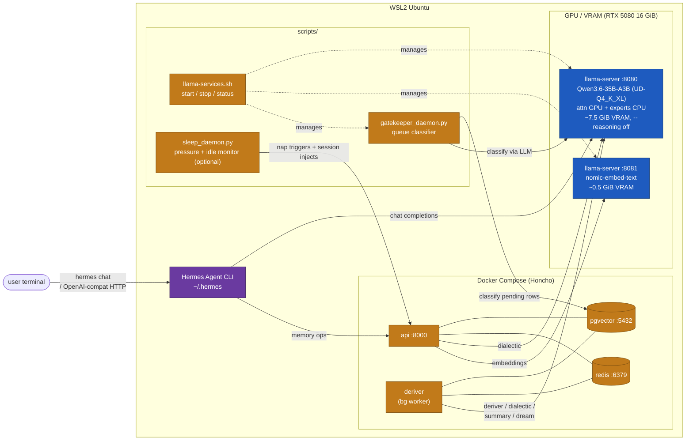

# nuncstans-hermes-stack

A recipe for running NousResearch's **Hermes Agent** fully locally against a single llama.cpp backend on a consumer GPU.

- The **Honcho** memory backend (deriver / dialectic / summary / dream) and the Hermes main chat share **one `llama-server` process on :8080** running Qwen3.6-35B with MoE expert-tensor CPU offload — ~7.5 GiB VRAM, ~36 tok/s decode on a 16 GiB RTX 5080.
- Embeddings go through a **second `llama-server` process on :8081** serving nomic-embed-text (aliased as `openai/text-embedding-3-small` so Honcho's hardcoded lookup resolves locally).
- No cloud API key is required anywhere.

Target host: **WSL2 Ubuntu**. It is possible to run directly on Windows, but the Hermes installer and Honcho's docker-compose assume Linux, so staying inside WSL2 avoids a lot of paper cuts.

See `experiments/bench-moe-offload/report.md` for the placement benchmark that led to this config, `experiments/benchmark-honcho-hermes.md` for the Hermes end-to-end comparison across backends, and `experiments/bottleneck.md` for the multi-layer bug investigation that preceded the collapse to a single endpoint.

The original two-endpoint design (Bonsai-8B on `llama-server` for Honcho-side work plus Ollama for chat) is archived in `experiments/bonsai-archive.md`. That recipe is still valid on ≥24 GiB GPUs or multi-host deployments; it's just not the right shape for a 16 GiB card.

## Architecture

### Repository structure

This outer repo pins three git submodules — all the actual code lives in the linked repos, this repo only tracks which commit of each to build against:

| Submodule | URL | Branch | Notes |
|---|---|---|---|
| `honcho/` | `baba-yu/nuncstans-honcho` | `dev` | Fork of `plastic-labs/honcho` with the gatekeeper classifier, peer-filtered deriver, `supersede_observations` tool, 768-dim vector columns, relaxed vector-dim validator, and the `tool_choice: "any"` → `"required"` normalization patch that makes dialectic/deriver work against llama.cpp's OpenAI-compatible server. |
| `llama.cpp/` | `ggml-org/llama.cpp` | `master` | Upstream llama.cpp. Source for the `llama-server` binary that serves both the Qwen3.6 chat model and the nomic-embed-text embedding model. Unmodified. (Up through 2026-04 this pointed at `PrismML-Eng/llama.cpp` on a `prism` branch carrying Q1_0 quantization patches needed by Bonsai-8B; since Bonsai-8B is archived, we switched to upstream — see `experiments/llamacpp-upstream-migration.md`. The submodule was also previously checked out at `bonsai-llama.cpp/`; see `experiments/bonsai-archive.md` if you are reading older commits.) |
| `honcho-self-hosted/` | `elkimek/honcho-self-hosted` | `main` | Upstream config overlay for running vanilla `plastic-labs/honcho`. Kept as the alternative stack (see [Switching stacks](#switching-between-the-gatekeeper-stack-and-upstream-honcho)). Unmodified. |

**Clone with submodules:**

```bash
git clone --recursive https://github.com/baba-yu/nuncstans-hermes-stack.git
# — or, if you already cloned without --recursive —
cd nuncstans-hermes-stack && git submodule update --init --recursive
```

**Update submodules later:**

```bash
# Re-pin to the commits this repo currently tracks (after `git pull`)
git submodule update --init --recursive

# Pull the tip of each submodule's tracked branch and bump this repo's pointer
git submodule update --remote
git add honcho llama.cpp honcho-self-hosted
git commit -m "Bump submodules"
```

Note: the local modifications you make inside `honcho/` (e.g. editing `config.toml`, which upstream `.gitignore`s) stay local to that submodule's working tree and are not tracked here. Commits inside `honcho/` go to the `baba-yu/nuncstans-honcho` fork; this repo only records which honcho commit to use.

### Process layout



### Roles

| Component | Process | Resource | Responsibility |
|---|---|---|---|
| Chat `llama-server` (:8080) | `scripts/llama-services.sh` → `llama-server -hf unsloth/Qwen3.6-35B-A3B-GGUF:UD-Q4_K_XL` with MoE expert offload (`-ot "ffn_(up\|down\|gate)_exps=CPU"`) and `--reasoning off` | GPU attention + KV + shared projections ~7.5 GiB VRAM; experts on CPU / DDR5 | Hermes main inference **and** Honcho deriver / dialectic / summary / dream |
| Embedding `llama-server` (:8081) | same script → `llama-server --embeddings` against the nomic-embed-text GGUF | GPU ~0.5 GiB VRAM | Honcho embeddings. Aliased as `openai/text-embedding-3-small` so Honcho's hardcoded name resolves locally |
| Honcho | api + deriver + Postgres (pgvector) + Redis via Docker Compose | CPU / RAM | Conversation memory and user modelling |
| Gatekeeper daemon | `python3 scripts/gatekeeper_daemon.py` (started by `llama-services.sh start` after chat + embed come up) | — | Classifies each pending representation queue row against the A/B literalness axes and importance; promotes to `ready` (deriver picks up) or demotes. Uses `:8080` as the classifier LLM via `GK_LLM_URL` / `GK_LLM_MODEL`. |
| sleep_daemon (optional) | `python3 scripts/sleep_daemon.py` (systemd user service) | — | Detects idle or pending-queue pressure, fires dream + injects English system messages into the active session. Not started by `llama-services.sh`; bring up by hand or via systemd when observation count makes consolidation worthwhile. |
| Hermes Agent | `hermes` CLI (also serves an OpenAI-compatible HTTP endpoint) | — | Orchestration |

**Why a single chat endpoint serves both Hermes chat and Honcho's memory loops:** the MoE expert-tensor offload trick (`-ot ffn_(up|down|gate)_exps=CPU`) keeps attention + shared projections on the GPU while pushing the ~22 GiB of MoE FFN expert tensors to host RAM. Because Qwen3.6 is an A3B architecture (~3 B active parameters per token), the CPU side only executes a 3 B-scale matmul per token, not 36 B — the "nominally CPU" experts act like a tiny dense model on CPU. Combined with `--reasoning off` (which neutralizes the qwen3 thinking-token leak documented at [llama.cpp#20099](https://github.com/ggml-org/llama.cpp/issues/20099)), the chat server finishes a representative 4 k-prompt / 200-token Hermes turn in ~5.5 s isolated, ~12 s when Honcho's deriver is hitting it concurrently — interactive even under load.

The two-endpoint design (Bonsai + Ollama) that this replaces is archived in `experiments/bonsai-archive.md`.

### Persistent runtime assets

What keeps the stack running between reboots. If you're coming back to this repo after a break and wondering "which of these am I actually supposed to start?", read this table top-to-bottom. Per-process flags and config-file contents are documented in the Setup section; this is an inventory, not a reference.

| Asset | Path | Purpose | Started by |
|---|---|---|---|
| Chat `llama-server` | `llama.cpp/build/bin/llama-server` serving `unsloth/Qwen3.6-35B-A3B-GGUF:UD-Q4_K_XL` on `:8080` | Hermes main chat **and** Honcho memory loops (dialectic / deriver / summary / dream) | `./scripts/llama-services.sh start` |
| Embedding `llama-server` | same binary, `-m` against the nomic-embed-text GGUF, on `:8081` | Honcho embeddings (aliased as `openai/text-embedding-3-small`) | `./scripts/llama-services.sh start` |
| Honcho stack | `honcho/docker-compose.yml` — api + deriver + pgvector + redis | Memory store + extraction pipeline | `cd honcho && docker compose up -d` |
| Gatekeeper daemon | `scripts/gatekeeper_daemon.py` | Classifies pending representation rows → ready / demoted, keeps trivia out of the observation store before the deriver picks them up. Uses the chat `:8080` as its classifier LLM (`GK_LLM_URL` / `GK_LLM_MODEL`). | Started by `./scripts/llama-services.sh start` as the third service (after chat + embed) |
| Sleep daemon (optional) | `scripts/sleep_daemon.py` | Fires Honcho's Dream consolidation agent on idle / pending-queue / token-count triggers. Not required for correctness; leave off until observation count makes consolidation worthwhile. See `experiments/memory-consolidation.md`. | Optional systemd user service; not part of `llama-services.sh` |
| Hermes Agent | `~/.hermes/config.yaml` + `~/.hermes/honcho.json` | User-facing CLI. Points main model at `:8080`, memory at `:8000` (Honcho). | `hermes` |
| Logs + PIDs | `~/.local/state/nuncstans-hermes-stack/{chat,embed,gatekeeper}-{server,}.{log,pid}` | Per-process supervisor state for `llama-services.sh`. Tail via `./scripts/llama-services.sh logs {chat\|embed\|gk}`. | Written by `llama-services.sh` |

#### Hermes plugin knobs worth calling out (`~/.hermes/honcho.json`)

The Honcho plugin has two settings that turn a working-but-slow install into a comfortable one. Both live in `~/.hermes/honcho.json`, which is user-local state (not tracked in this repo). See `experiments/save-point-pivot.md` for the full derivation.

- `"recallMode": "tools"` — hide Honcho's per-turn dialectic auto-inject and expose the memory tools (`search_memory`, `get_observation_context`, …) instead. The chat model calls them on demand, so turns that don't need recall skip the 60 s dialectic stall entirely. With the default `"hybrid"`, every single turn — including `hello` — pays one dialectic LLM call. Think of it as switching from per-frame memory rendering to a save-point: writes still fire asynchronously on every user message, reads only fire when the model actively asks.
- `"initOnSessionStart": true` — force the plugin to call `workspaces.sessions.create` at chat start instead of deferring it to the first tool call. Required whenever `recallMode: "tools"` is used, because a conversation that doesn't trigger a tool call otherwise never creates the session, and all the `messages.create` calls silently fail against the missing session id. Every message you send gets dropped; across-session memory silently doesn't work.

A minimal `~/.hermes/honcho.json` that matches this stack:

```json
{
  "baseUrl": "http://localhost:8000",
  "hosts": {
    "hermes": {
      "enabled": true,
      "aiPeer": "hermes",
      "peerName": "you",
      "workspace": "hermes",
      "observationMode": "directional",
      "writeFrequency": "async",
      "recallMode": "tools",
      "dialecticCadence": 3,
      "sessionStrategy": "per-session",
      "saveMessages": true,
      "initOnSessionStart": true
    }
  }
}
```

## Setup

### Prerequisites

Expect these tools inside WSL2 Ubuntu:

| Requirement | Check |
|---|---|
| WSL2 + Ubuntu | `wsl --status` from Windows |
| NVIDIA GPU passthrough | `nvidia-smi -L` |
| Docker Engine + Compose v2 | `docker --version && docker compose version` |
| Build toolchain | `gcc --version && cmake --version && git --version` |
| CUDA toolkit 12.x | `nvcc --version` (see `experiments/maintainer-notes.md` for why not 13.x) |
| Disk | Qwen3.6-35B GGUF ~19 GiB (Q4 quant) + nomic-embed-text ~260 MiB + llama.cpp build ~2 GiB + Honcho volumes ~2 GiB |

Install the missing pieces (Ubuntu 22.04 / 24.04):

```bash
sudo apt update
sudo apt install -y build-essential cmake git curl ca-certificates

# Docker (skip if you already have Docker Desktop)
curl -fsSL https://get.docker.com | sudo sh
sudo usermod -aG docker "$USER"
newgrp docker

# CUDA toolkit 12.9 (required for the GPU build — see
# experiments/maintainer-notes.md for why 13.x fails on current WSL)
wget https://developer.download.nvidia.com/compute/cuda/repos/wsl-ubuntu/x86_64/cuda-keyring_1.1-1_all.deb
sudo dpkg -i cuda-keyring_1.1-1_all.deb
sudo apt-get update
sudo apt-get -y install cuda-toolkit-12-9
echo 'export PATH=/usr/local/cuda/bin:$PATH' >> ~/.bashrc
echo 'export LD_LIBRARY_PATH=/usr/local/cuda/lib64:$LD_LIBRARY_PATH' >> ~/.bashrc
source ~/.bashrc
nvcc --version   # should print "release 12.9"
```

Everything below runs inside **WSL2 Ubuntu**. The working directory is `$HOME/nuncstans-hermes-stack`.

> **Two Honcho stacks, pick one.** The default **gatekeeper stack** (under `honcho/`) includes the local modifications described throughout this README. An alternative **upstream stack** shipped under `honcho-self-hosted/` runs vanilla `plastic-labs/honcho` against the same llama.cpp backends. See [Switching stacks](#switching-between-the-gatekeeper-stack-and-upstream-honcho).

### Step 1. Build `llama-server` with `$ORIGIN` RPATH

Upstream `ggml-org/llama.cpp` is already checked out at `llama.cpp/` by the recursive submodule clone. Build it **with CUDA on**.

```bash
cd "$HOME/nuncstans-hermes-stack/llama.cpp"
export PATH=/usr/local/cuda/bin:$PATH
export LD_LIBRARY_PATH=/usr/local/cuda/lib64:$LD_LIBRARY_PATH
cmake -B build \
  -DGGML_CUDA=ON \
  -DCMAKE_BUILD_RPATH_USE_ORIGIN=ON \
  -DCMAKE_INSTALL_RPATH='$ORIGIN' \
  -DCMAKE_BUILD_WITH_INSTALL_RPATH=ON
cmake --build build -j --config Release --target llama-server
```

The CUDA build takes 5–10 minutes on a typical dev box; the heavy part is `ggml-cuda`'s CUDA kernels (there are many template instantiations per quantization type). The Blackwell `120a-real` architecture is added automatically by the fork's CMake when CUDA ≥ 12.8 is detected.

**Note — the three extra `RPATH` flags are load-bearing, don't drop them.** Without them, CMake bakes the absolute build-tree path (e.g. `/home/you/nuncstans-hermes-stack/llama.cpp/build/bin`) as `RUNPATH` into `llama-server` and every `lib*.so`. Rename or move the parent directory afterwards and `llama-server` dies at startup with `error while loading shared libraries: libmtmd.so.0: cannot open shared object file` even though the `.so` is sitting right next to the binary. This is a known upstream issue in `ggml-org/llama.cpp` ([#17193](https://github.com/ggml-org/llama.cpp/issues/17193), [#17190](https://github.com/ggml-org/llama.cpp/issues/17190), [#17950](https://github.com/ggml-org/llama.cpp/issues/17950)); upstream's merged fix ([PR #17214](https://github.com/ggml-org/llama.cpp/pull/17214)) only addresses the Docker-symlink side, not the absolute-RPATH side, so the `$ORIGIN` flags above are still required for local builds. The downstream consequence matters: if `llama-server` is silently down, Honcho keeps routing `dialectic` / `deriver` / `summary` / `dream` calls to `:8080`, each one stalls ~60 s in `tenacity` retries before giving up, and the whole Hermes loop feels hung. Verify after build with `readelf -d build/bin/llama-server | grep RUNPATH` — you want `[$ORIGIN]`, not an absolute path.

The cmake output is just the **`llama-server` executable** — the inference engine. You'll fetch the model GGUFs in Step 2.

### Step 2. Fetch the GGUFs

**Chat model (Qwen3.6-35B-A3B) — auto-downloaded by `llama-server`.** The `scripts/llama-services.sh start` command launches `llama-server` with `-hf unsloth/Qwen3.6-35B-A3B-GGUF:UD-Q4_K_XL`. On the first start llama.cpp downloads the GGUF from HuggingFace into `~/.cache/llama.cpp/` — roughly 19 GiB, takes 15–30 min depending on your connection. Subsequent starts skip the download. No manual fetch needed.

**Embedding model (nomic-embed-text) — explicit blob path.** The script currently points `EMBED_BLOB` at a specific ollama-cached blob:

```
EMBED_BLOB="/usr/share/ollama/.ollama/models/blobs/sha256-970aa74c0a90ef7482477cf803618e776e173c007bf957f635f1015bfcfef0e6"
```

This is the GGUF that ollama originally pulled for `nomic-embed-text` in the legacy two-endpoint stack. If the blob is already on disk from that era, no action is needed. If you are bootstrapping fresh, choose one:

- **Option A (one-off ollama use):** install ollama once (`curl -fsSL https://ollama.com/install.sh | sh`), run `ollama pull nomic-embed-text`, and the blob will live at the path above. You can stop / mask the ollama service afterwards — hermes-stack never calls ollama at runtime.
- **Option B (skip ollama entirely):** download the nomic-embed-text GGUF from HuggingFace into `$HOME/nuncstans-hermes-stack/models/` and edit `EMBED_BLOB` in `scripts/llama-services.sh` to point at your file.

### Step 3. Start the llama-server processes and gatekeeper

`scripts/llama-services.sh` manages three things idempotently: chat llama-server (`:8080`), embedding llama-server (`:8081`), and the `gatekeeper_daemon.py` classifier. Same command brings them up if they're down, is a no-op if they're up:

```bash
cd "$HOME/nuncstans-hermes-stack"
./scripts/llama-services.sh start           # all three; or: start {chat|embed|gk} for one
./scripts/llama-services.sh status
```

Expected `status` output (when healthy):

```
  chat   pid 12345  port 8080  healthy  log ~/.local/state/nuncstans-hermes-stack/chat-server.log
  embed  pid 12346  port 8081  healthy  log ~/.local/state/nuncstans-hermes-stack/embed-server.log
  gk     pid 12347  daemon    running   log ~/.local/state/nuncstans-hermes-stack/gatekeeper.log
```

The actual `llama-server` invocation is built from `scripts/llama-services.conf`; the shell script only glues in MoE/reasoning flags conditionally. For the per-flag rationale (`-ot` MoE offload, `--reasoning off` for qwen3, KV partitioning across `--parallel` slots, etc.) see [`docs/specs/scripts/llama-services.md`](docs/specs/scripts/llama-services.md).

Logs and PIDs land under `~/.local/state/nuncstans-hermes-stack/` (override via `HERMES_STATE_DIR`). Single-instance per host is the working assumption — see the spec doc for the multi-instance / containerization guidance.

Smoke test both endpoints:

```bash
curl -s http://localhost:8080/v1/models | jq -r '.data[].id'     # qwen3.6-test
curl -s http://localhost:8081/v1/models | jq -r '.data[].id'     # openai/text-embedding-3-small

curl -s http://localhost:8080/v1/chat/completions \
  -H 'Content-Type: application/json' \
  -d '{"model":"qwen3.6-test","messages":[{"role":"user","content":"ping"}],"max_tokens":8}' | jq .

curl -s http://localhost:8081/v1/embeddings \
  -H 'Content-Type: application/json' \
  -d '{"model":"openai/text-embedding-3-small","input":"hello"}' | jq '.data[0].embedding | length'   # 768
```

### Step 4. Critical Honcho hyperparameters

Materialize `honcho/config.toml` from the committed template:

```bash
cp "$HOME/nuncstans-hermes-stack/honcho/config.toml.hermes-example" \
   "$HOME/nuncstans-hermes-stack/honcho/config.toml"
```

The template is already tuned for this stack; the four knobs below are the ones that produced distinct silent-failure modes during bring-up and are worth knowing by name:

| Knob | Value | If wrong |
|---|---|---|
| `[deriver] REPRESENTATION_BATCH_MAX_TOKENS` | **200** (scaffold 1024) | deriver never fires on casual chat — messages land in Postgres but no observations, `hermes memory status` stays empty |
| `[embedding] MAX_INPUT_TOKENS` | **2048** (scaffold 8192) | nomic-embed-text 400s on long messages — Honcho's chunker won't split |
| `[vector_store] DIMENSIONS = 768`, `MIGRATED = true` | **both must match** | pgvector columns stay at upstream's `Vector(1536)` and every insert rolls back "expected 1536 not 768" |
| `scripts/sleep_daemon.py` thresholds: `PENDING_THRESHOLD`, `TOKEN_THRESHOLD`, `IDLE_TIMEOUT_MINUTES` | 10 / 1000 / 10 | nap cadence wrong → memory consolidation lags or over-fires; see [`docs/specs/scripts/sleep_daemon.md`](docs/specs/scripts/sleep_daemon.md) |

For the full rationale on each of these, and the less-critical knobs (`max_output_tokens`, `MAX_TOOL_ITERATIONS`, fallback-model caveat), see:

- [`docs/specs/scripts/gatekeeper_daemon.md`](docs/specs/scripts/gatekeeper_daemon.md) — deriver path + queue classification
- [`docs/specs/scripts/sleep_daemon.md`](docs/specs/scripts/sleep_daemon.md) — nap thresholds and dream model selection
- [`docs/specs/scripts/llama-services.md`](docs/specs/scripts/llama-services.md) — how `-c`/`--parallel` on llama-server bounds Honcho's context/MAX_INPUT caps

### Step 5. `honcho/config.toml` reference

The live `config.toml` is upstream-`.gitignore`d; Step 4 materialized it from `honcho/config.toml.hermes-example` — that file in the repo is the **canonical reference** for every block (9 chat `model_config` blocks + 1 embedding block + `[vector_store]` / `[deriver]` / `[dream]` knobs).

Per-block editing notes and the automated rewrite path (via `./scripts/switch-endpoints.py`) live in [`docs/specs/scripts/switch-endpoints.md`](docs/specs/scripts/switch-endpoints.md). For runtime overrides without touching TOML, `pydantic-settings` reads nested fields via a `__` delimiter — e.g. `DERIVER_MODEL_CONFIG__OVERRIDES__BASE_URL=...` in `honcho/.env`.

### Step 6. Bring up Honcho

```bash
cd "$HOME/nuncstans-hermes-stack/honcho"
docker compose up -d
docker compose ps
curl -s http://localhost:8000/health
```

The submodule ships its own `docker-compose.override.yml` that adds `host.docker.internal:host-gateway` to the `api` and `deriver` services (native Linux Docker Engine does not resolve that alias out of the box), and resets `ports: []` on `database` and `redis` so the published 5432 / 6379 ports don't collide if the host already runs Postgres or Redis. No manual override editing is required.

Confirm the container sees the committed endpoints:

```bash
docker compose exec api python3 <<'PY'
from src.config import settings
def ep(mc):
    return f"{mc.transport}/{mc.model} at {mc.overrides.base_url}"
print('deriver       ->', ep(settings.DERIVER.MODEL_CONFIG))
print('dialectic.max ->', ep(settings.DIALECTIC.LEVELS['max'].MODEL_CONFIG))
print('summary       ->', ep(settings.SUMMARY.MODEL_CONFIG))
print('dream/deduc   ->', ep(settings.DREAM.DEDUCTION_MODEL_CONFIG))
print('dream/induc   ->', ep(settings.DREAM.INDUCTION_MODEL_CONFIG))
print('embed         ->', ep(settings.EMBEDDING.MODEL_CONFIG))
PY
# deriver       -> openai/qwen3.6-test at http://host.docker.internal:8080/v1
# ...
# embed         -> openai/openai/text-embedding-3-small at http://host.docker.internal:8081/v1
```

### Step 7. Install Hermes Agent and wire it up

`--skip-setup` keeps the installer non-interactive.

```bash
curl -fsSL https://raw.githubusercontent.com/NousResearch/hermes-agent/main/scripts/install.sh \
  | bash -s -- --skip-setup
export PATH="$HOME/.local/bin:$PATH"   # if you're staying in the same shell
hermes --version
```

Point the main inference at the local chat server:

```bash
hermes setup        # follow the wizard
# or set it piecewise:
hermes model        # Provider=custom (OpenAI-compatible), Base URL=http://localhost:8080/v1, Model=qwen3.6-test
```

Point memory at the local Honcho. The interactive wizard is more extensive than the `hermes memory status` summary suggests — it walks through 11 prompts and writes the result to `~/.hermes/honcho.json`, then flips `memory.provider = honcho` in `config.yaml` and validates the connection:

```bash
hermes memory setup
```

Prompts in order, with defaults shown in `[brackets]`. Accepting every default (just hitting Enter) gets you a working setup against the local Honcho — customize only if you know why:

| # | Prompt | Default | Choices / meaning |
|---|---|---|---|
| 1 | `Cloud or local?` | `local` | `cloud` = Honcho cloud at `api.honcho.dev`. `local` = your self-hosted server. |
| 2 | `Base URL` | `http://localhost:8000` | Only change if you remapped the api container's port. After this the wizard prints `No API key set. Local no-auth ready.` — expected in this setup (`USE_AUTH=false`). |
| 3 | `Your name (user peer)` | your Unix username | Peer ID for the human side. Keep it stable — changing it later makes Honcho treat the new name as a different peer with zero history. |
| 4 | `AI peer name` | `hermes` | Peer ID for the assistant side. Also stable; observations are keyed on it. |
| 5 | `Workspace ID` | `hermes` | Top-level container for all peers and sessions. Use different workspace IDs to run multiple unrelated setups against the same Honcho instance. |
| 6 | `Observation mode` | `directional` | `directional` = all observations on, each AI peer builds its own view (what the gatekeeper fork is tuned for). `unified` = shared pool; user observes self, AI observes others only. |
| 7 | `Write frequency` | `async` | `async` = background thread, no token cost (recommended). `turn` = sync write after every turn. `session` = batch write at session end. `N` = every N turns (e.g. `5`). |
| 8 | `Recall mode` | `hybrid` | `hybrid` = auto-injected context **and** Honcho tools exposed to the chat model. `context` = auto-inject only (tools hidden). `tools` = tools only, no auto-injection. |
| 9 | `Context tokens` | `uncapped` | Only shown for `hybrid` / `context` recall modes. `uncapped` = no limit. `N` = per-turn token cap (e.g. `1200`). Skipped entirely if recall mode is `tools`. |
| 10 | `Dialectic cadence` | `3` | How often Honcho rebuilds its user model (each rebuild is an LLM call on the Honcho backend, i.e. on the chat server in this stack). `1` = every turn (aggressive), `3` = every 3 turns (recommended), `5+` = sparse. |
| 11 | `Session strategy` | `per-session` | `per-session` = fresh session per run, Honcho auto-injects context. `per-directory` = reuse session per cwd. `per-repo` = one session per git repo. `global` = single session across everything. |

For a quick re-check after restarts:

```bash
hermes memory status   # expect Provider: honcho / Plugin: installed / Status: available
```

**Non-interactive path.** If you want to skip the wizard entirely, the cleanest approach is to run the wizard once to generate a known-good `~/.hermes/honcho.json`, then commit that file as your template and copy it into place on new machines. The 11 wizard answers map to a JSON shape that covers `baseUrl` plus per-host `aiPeer` / `peerName` / `workspace` plus the observation / write-frequency / recall / cadence / session-strategy settings, and the exact key names are hermes-version-dependent.

A bare-bones starter `honcho.json` covering the connection + peer/workspace identity + the two knobs that make this stack comfortable (see [Persistent runtime assets](#persistent-runtime-assets) for why these two matter):

```bash
cat > "$HOME/.hermes/honcho.json" <<'JSON'
{
  "baseUrl": "http://localhost:8000",
  "hosts": {
    "hermes": {
      "enabled": true,
      "aiPeer": "hermes",
      "peerName": "you",
      "workspace": "hermes",
      "recallMode": "tools",
      "initOnSessionStart": true
    }
  }
}
JSON
hermes config set memory.provider honcho
hermes memory status
```

If you already ran the wizard, this `cat > ...` will overwrite your choices — edit `aiPeer` / `peerName` / `workspace` to match what you entered, or skip the redirect entirely and just run `hermes config set memory.provider honcho` against the wizard-generated file.

## Switching between the gatekeeper stack and upstream Honcho

This repo bundles **two mutually-exclusive honcho deployments**, so you can toggle between the local modifications and vanilla upstream without re-cloning anything.

| Stack | Path | Source | Notable |
|-------|------|--------|---------|
| **Gatekeeper (default)** | `honcho/` | Forked `plastic-labs/honcho` with local modifications | Message classifier (`scripts/gatekeeper_daemon.py`), peer-filtered deriver, `supersede_observations` tool, added `queue.status` / `queue.gate_verdict` columns + indexes, `FLUSH_ENABLED=true`, `tool_choice=any→required` normalization for llama.cpp compat. |
| **Upstream** | `honcho-self-hosted/` config overlay + pristine clone at `~/honcho` | Vanilla `plastic-labs/honcho` | Tracks upstream releases exactly. No gatekeeper, no peer filter, no supersede. Useful for bug reproduction against upstream or A/B comparison. **Note**: the upstream openai backend does not normalize `tool_choice="any"`, so dialectic/deriver against the llama.cpp chat server will 400. For the upstream stack either re-apply that patch or point Honcho at an openai / vLLM endpoint. |

Both stacks bind the same host ports (Postgres 5432, Redis 6379, API 8000), so only one can run at a time. Each stack's memory lives in its own `pgdata` Docker volume; switching stacks does **not** migrate observations — the gatekeeper stack's memory and the upstream stack's memory are separate databases.

### Run the gatekeeper stack (default)

```bash
cd "$HOME/nuncstans-hermes-stack/honcho"
docker compose up -d
```

### Run the upstream stack

First-time setup — clones `plastic-labs/honcho` into `~/honcho` and overlays the config files from `honcho-self-hosted/`:

```bash
# stop gatekeeper stack if it's up
(cd "$HOME/nuncstans-hermes-stack/honcho" && docker compose down) 2>/dev/null || true

bash "$HOME/nuncstans-hermes-stack/honcho-self-hosted/setup.sh"
```

Subsequent runs:

```bash
(cd "$HOME/nuncstans-hermes-stack/honcho" && docker compose down) 2>/dev/null || true
cd "$HOME/honcho" && docker compose up -d
```

### Keep the two stacks' data isolated

Both compose projects default their name to `honcho` (from their directory names), which means both map to the same `honcho_pgdata` / `honcho_redis-data` named volumes — bringing the upstream stack up on top of the gatekeeper DB would mix schemas and corrupt both.

Pin an explicit project name per stack to keep volumes separate:

```bash
# gatekeeper
cd "$HOME/nuncstans-hermes-stack/honcho"
COMPOSE_PROJECT_NAME=honcho-gatekeeper docker compose up -d

# upstream
cd "$HOME/honcho"
COMPOSE_PROJECT_NAME=honcho-upstream docker compose up -d
```

Easiest lasting fix: add `COMPOSE_PROJECT_NAME=honcho-gatekeeper` to `honcho/.env` and `COMPOSE_PROJECT_NAME=honcho-upstream` to `~/honcho/.env`.

## Running, stopping, restarting

```bash
# llama-server processes (chat on :8080, embedding on :8081, gatekeeper daemon).
# start / stop / restart accept an optional target: all (default) | chat | embed | gk.
./scripts/llama-services.sh start          # all three
./scripts/llama-services.sh stop chat      # e.g. reclaim :8080 VRAM after moving to ollama
./scripts/llama-services.sh restart gk
./scripts/llama-services.sh status
./scripts/llama-services.sh logs chat      # tail one log: chat | embed | gk

# Honcho (data survives in the named volumes)
cd "$HOME/nuncstans-hermes-stack/honcho" && docker compose down
cd "$HOME/nuncstans-hermes-stack/honcho" && docker compose up -d
```

## Switching endpoints / models

`scripts/switch-endpoints.py` is a conversational CLI that swaps Honcho's and Hermes's LLM backends (and the local `llama-server` model on request) under a snapshot + auto-rollback envelope. Runs via `uv run --script` — deps are declared in the script header.

```bash
./scripts/switch-endpoints.py --dry-run           # preview diffs, no writes
./scripts/switch-endpoints.py                     # real run, 3 axes by default
./scripts/switch-endpoints.py --with-embed        # full picker on the embed axis (endpoint + model both)
./scripts/switch-endpoints.py --unload-ollama     # force-unload stale ollama models (skip the interactive prompt)
./scripts/switch-endpoints.py --list-snapshots
./scripts/switch-endpoints.py --rollback
./scripts/switch-endpoints.py --restore <id>
```

The default flow asks three axes (Honcho chat, Hermes, optional llama-server model). If Axis A changes engine (ollama ↔ llama-server), a single extra prompt offers to move Honcho embed to the matching engine's nomic-embed-text endpoint (same 768 dim, no DB migration). Changing the chat engine also auto-syncs the gatekeeper classifier (`GK_LLM_URL` / `GK_LLM_MODEL` in `scripts/llama-services.conf`) so the whole stack follows one engine.

For parameter derivation rules (`-c` / `-ngl` / MoE / reasoning / `--parallel`), snapshot layout + manifest schema, Honcho cap co-movement, the Hermes two-layer provider sync (which this script always performs to avoid the display-vs-runtime bifurcation in Hermes v0.10), and the ollama pitfalls the switcher warns about (`OLLAMA_CONTEXT_LENGTH` silent truncation, qwen3 `think` flag, tool-call stability), see [`docs/specs/scripts/switch-endpoints.md`](docs/specs/scripts/switch-endpoints.md).

Snapshots and logs live under `~/.local/state/nuncstans-hermes-stack/` by default; override with `HERMES_STATE_DIR` when running a second instance on the same host. Single-instance per host is the assumed operating mode — see the spec doc for the containerization outlook.

## Smoke test

Confirm `hermes doctor` is all green, then follow the "chat and watch memory grow" procedure below to verify end-to-end.

### Open observation panes

Use three terminals (tmux panes or iTerm splits both work):

- **Pane W (watch)** — the pipeline-wide helper that shows memory formation in one place:
  ```bash
  bash ~/nuncstans-hermes-stack/test/uat/scripts/watch_memory.sh
  ```
  The script color-tags three streams:
  - `[llama ]` prompt-processing and generation lines from the chat `llama-server` (`~/.local/state/nuncstans-hermes-stack/chat-server.log`)
  - `[deriver]` Honcho deriver container logs (observation extraction + save moments)
  - `[docs  ]`  prints one line each time the `documents` row count changes

- **Pane C (chat)** — talk to Hermes:
  ```bash
  hermes
  ```

- **Pane R (REPL / inspect)** — for hitting the API directly when needed.

### Send a fact-rich turn and watch the stack light up

In **pane C**, send a single turn that is "dense enough to observe":

```
I'm Alice. I drink matcha latte every morning, I go rock climbing at the
Gravity Gym every Sunday, and I ride a red road bike to the gym. I live
in Kyoto and work as a backend engineer. I keep a bonsai collection
(mostly junipers), and my cat is named Miso.
```

Immediately after send, **pane W** should scroll through these events in order:

1. `[llama ] launch_slot_: ... processing task` — chat server received the request
2. `[llama ] prompt processing progress ... progress = 0.xx` → `prompt processing done` — prompt ingestion
3. `[llama ] print_timing` and `release: ... stop processing` — one inference turn finished
4. `[deriver] ⚡ PERFORMANCE - ... Observation Count 1 count` — an observation was extracted
5. `[docs  ] documents total = N` — row written to the database

When pane W goes quiet and `documents` has ticked up, one observation has been formed. On the L6 expert-offload config this takes **~5–15 seconds per turn** under light load, ~12 s when concurrent deriver pressure is high.

### Confirm the memory actually landed

In **pane R**, hit the representation endpoint to read what was extracted:

```bash
WS=$(jq -r '.hosts.hermes.workspace' ~/.hermes/honcho.json)
PEER=$(jq -r '.hosts.hermes.peerName' ~/.hermes/honcho.json)
echo "workspace=$WS peer=$PEER"

curl -sf -X POST "http://localhost:8000/v3/workspaces/$WS/peers/$PEER/representation" \
  -H 'Content-Type: application/json' -d '{}' | jq -r .representation
```

Expected output shape:

```
## Explicit Observations

[2026-04-17 17:05:15] I'm Alice. I drink matcha latte every morning, I go
rock climbing at the Gravity Gym every Sunday, ... my cat is named Miso.
```

### Cross-session recall

Exit `hermes` in **pane C**, relaunch it (new session), and ask:

```
What do you remember about me?
```

Hermes routes the recall through Honcho's dialectic → the same local `llama-server` on :8080 that serves chat. In **pane W** you'll see `[llama ] launch_slot_ ...` fire for the dialectic inference, and the response should include the facts you seeded (matcha / climbing / Kyoto / bonsai / Miso / etc.).

### Check what the stack is actually wired to (optional)

```bash
# chat and embedding endpoints
curl -s http://localhost:8080/v1/models | jq '.data[].id'
curl -s http://localhost:8081/v1/models | jq '.data[].id'

# Honcho's view of the endpoints
cd ~/nuncstans-hermes-stack/honcho && docker compose exec -T api python3 <<'PY'
from src.config import settings
def ep(mc):
    return f"{mc.transport}/{mc.model} at {mc.overrides.base_url}"
print('deriver       ->', ep(settings.DERIVER.MODEL_CONFIG))
print('dialectic.max ->', ep(settings.DIALECTIC.LEVELS['max'].MODEL_CONFIG))
print('summary       ->', ep(settings.SUMMARY.MODEL_CONFIG))
print('dream/deduc   ->', ep(settings.DREAM.DEDUCTION_MODEL_CONFIG))
print('dream/induc   ->', ep(settings.DREAM.INDUCTION_MODEL_CONFIG))
print('embed         ->', ep(settings.EMBEDDING.MODEL_CONFIG))
PY
```

### Automated smoke suite (optional)

The repository ships an acceptance test that drives the whole pipeline and produces a pass/fail report:

```bash
bash ~/nuncstans-hermes-stack/test/uat/scripts/run_all.sh
# -> test/uat/results/<run-id>/REPORT.md
```

See `test/uat/plan/PLAN.md` for scenario details. See `experiments/uat-suite.md` for the S7 / S8 / S9 UAT scripts that exercise the gatekeeper → deriver → supersede pipeline end-to-end against the running stack.

## Troubleshooting

- **`docker compose up` fails with `port is already allocated` on 5432 / 6379** — you have another Postgres or Redis on the host. The `ports: !reset []` entries in the submodule's `docker-compose.override.yml` keep Honcho's services internal to the compose network and sidestep the conflict.
- **`api` / `deriver` restart with `connection refused`** — `host.docker.internal` is not resolving. Confirm `docker-compose.override.yml` sits next to `docker-compose.yml` in `honcho/` and that `extra_hosts` is indented correctly.
- **`hermes memory status` still shows `Provider: (none — built-in only)`** — dropping `honcho.json` is not enough. Run `hermes config set memory.provider honcho`.
- **`llama-server` segfaults at startup with no log output** — if you installed `cuda-toolkit-13-*`, the runtime tries to resolve D3DKMT symbols (`D3DKMTOpenSyncObjectFromNtHandle`, `D3DKMTCreateNativeFence`, etc.) that are not present in the current WSL `libdxcore.so`. Confirm with `LD_DEBUG=files ./build/bin/llama-server --help 2>&1 | grep -i "error: symbol"`. Fix: uninstall 13.x and install 12.9 per the Prerequisites block.
- **`llama-server` dies with `libmtmd.so.0: cannot open shared object file` even though the `.so` is right next to the binary** — the build baked the absolute build-tree path as `RUNPATH`, and the directory has since been renamed or moved. Rebuild with the three `RPATH` flags in Step 1 and verify with `readelf -d build/bin/llama-server | grep RUNPATH` — you want `[$ORIGIN]`.
- **Hermes seems to "forget" everything after you quit with Ctrl+C** — Honcho is storing the messages, but the deriver only fires once a workspace's pending messages exceed `REPRESENTATION_BATCH_MAX_TOKENS`. The scaffold default (1024) is tuned for long, dense turns; casual chat (a few short sentences at a time) can sit below the threshold for a whole session, so zero observations get extracted and nothing is recallable. Lower it to `[deriver] REPRESENTATION_BATCH_MAX_TOKENS = 200` and restart the deriver: `cd ~/nuncstans-hermes-stack/honcho && docker compose up -d --build deriver`.
- **Honcho calls 400 with `Invalid tool_choice: any`** — you are running upstream `plastic-labs/honcho` (or stripped the fork's OpenAI-backend patch) against the llama.cpp chat server. Honcho's dialectic/deriver agents use `tool_choice = "any"` internally, and llama.cpp's OpenAI-compatible server rejects that value (the spec has `none | auto | required | function-name`; `"any"` is a vLLM / legacy-OpenAI synonym). The gatekeeper fork's `src/llm/backends/openai.py` normalizes `"any"` → `"required"`; re-apply that one-liner if you replaced the submodule with plain upstream.
- **Chat server returns empty `content` with `completion_tokens` in the hundreds** — qwen3 thinking-token leak ([llama.cpp#20099](https://github.com/ggml-org/llama.cpp/issues/20099)). Every token in the completion budget gets consumed by invisible reasoning and the actual answer never gets generated. Make sure `scripts/llama-services.sh` is passing `--reasoning off` to the chat server; check the process command line with `ps -ef | grep llama-server`.
- **Embeddings fail with `openai.AuthenticationError: 401`** — the OpenAI SDK inside the container got an empty `api_key`. Check `settings.EMBEDDING.MODEL_CONFIG.overrides.api_key` first, then the openai-transport fallback (`_default_embedding_api_key` in `src/config.py` returns `settings.LLM.OPENAI_API_KEY`). The reference TOML in Step 5 sets `[llm] OPENAI_API_KEY = "not-needed"` — if yours is missing that line, add it, or set `LLM_OPENAI_API_KEY=not-needed` in `.env`.
- **Embeddings fail with `model "openai/text-embedding-3-small" not found`** — the embed `llama-server` is not running, or was started without `--alias openai/text-embedding-3-small`. Check `./scripts/llama-services.sh status` and `curl -s http://localhost:8081/v1/models`.
- **Embedding dimension mismatch (`expected 1536 dimensions, not 768`)** — the fork's `h8i9j0k1l2m3` migration flips the pgvector columns to `Vector(768)`, and `[vector_store] MIGRATED = true` tells the relaxed validator to accept non-1536 dims. If you're hitting this, either the migration didn't run (check `docker compose logs api | grep alembic`) or a stale 1536-width volume survived from an earlier attempt — `docker compose down -v` then `up -d --build` to rebuild the schema. Do not `sed` `Vector(1536)` in `src/models.py` by hand; the migration is the supported path.
- **`the input length exceeds the context length` (HTTP 400 from the embed server)** — honcho's `EMBEDDING.MAX_INPUT_TOKENS` default (8192) is higher than `nomic-embed-text`'s 2048-token native context. Set `[embedding] MAX_INPUT_TOKENS = 2048` in `config.toml` so the chunker splits longer messages.
- **Deriver hangs and the chat server log shows `failed to find free space in the KV cache`** — a single request outgrew its per-slot KV budget. `scripts/llama-services.sh` ships with `-c 131072 --parallel 2`, meaning each slot gets 65 536 tokens. If Honcho's tool-call loop builds a prompt larger than that, drop `--parallel` to `1` so one request gets the full 131 072 tokens — edit `start_chat` in the script. Trade-off: you lose the Hermes/deriver concurrency slot split, so long turns may serialize on each other.
- **Hermes tool calls fail** — the main chat model does not support function calling. Qwen3.6-A3B advertises tools but needs `--jinja` on the llama-server side for the chat template to honor the `` block. Verify the process was launched with `--jinja`.
