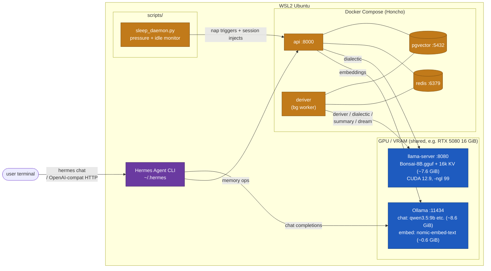

# nuncstans-hermes-stack

A recipe for running NousResearch's **Hermes Agent** fully locally.

- The **Honcho** memory backend's LLM calls (deriver / dialectic / summary / dream) are served by **Bonsai-8B** through `llama-server`, pinned to CPU and regular RAM.
- The main chat inference runs on **Ollama** with a heavy model, holding the GPU and VRAM.
- Embeddings also go through Ollama with a small embedding model, so no cloud API key is required anywhere.

Target host: **WSL2 Ubuntu**. It is possible to run directly on Windows, but the Hermes installer and Honcho's docker-compose assume Linux, so staying inside WSL2 avoids a lot of paper cuts.

## Architecture

### Repository structure

nuncstans-hermes-stack is a thin outer repo that pins three git submodules — all the actual code lives in the linked repos, nuncstans-hermes-stack only tracks which commit of each to build against:

| Submodule | URL | Branch | Notes |
|---|---|---|---|
| `honcho/` | `baba-yu/nuncstans-honcho` | `dev` | Fork of `plastic-labs/honcho` with the gatekeeper classifier, peer-filtered deriver, `supersede_observations` tool, 768-dim vector columns, and a relaxed vector-dim validator. |
| `bonsai-llama.cpp/` | `PrismML-Eng/llama.cpp` | `master` | Upstream PrismML fork of llama.cpp; built with CUDA 12.9 to produce the `llama-server` binary that hosts Bonsai. Unmodified. |
| `honcho-self-hosted/` | `elkimek/honcho-self-hosted` | `main` | Upstream config overlay for running vanilla `plastic-labs/honcho`. Kept as the alternative stack (see [Switching stacks](#switching-between-the-gatekeeper-stack-and-upstream-honcho)). Unmodified. |

**Clone with submodules:**

```bash
git clone --recursive https://github.com/baba-yu/nuncstans-hermes-stack.git
# — or, if you already cloned without --recursive —
cd nuncstans-hermes-stack && git submodule update --init --recursive
```

**Update submodules later:**

```bash
# Re-pin to the commits nuncstans-hermes-stack currently tracks (after `git pull`)
git submodule update --init --recursive

# Pull the tip of each submodule's tracked branch and bump nuncstans-hermes-stack's pointer
git submodule update --remote
git add honcho bonsai-llama.cpp honcho-self-hosted
git commit -m "Bump submodules"
```

Note: the local modifications you make inside `honcho/` (e.g. editing `config.toml`, which upstream `.gitignore`s) stay local to that submodule's working tree and are not tracked by nuncstans-hermes-stack. Commits inside `honcho/` go to the `baba-yu/nuncstans-honcho` fork; nuncstans-hermes-stack only records which honcho commit to use.

### Process layout



### Roles

| Component | Process | Resource | Responsibility |
|---|---|---|---|
| Ollama | `ollama serve` | GPU / VRAM (~9 GiB) | Hermes main inference + embeddings |
| Bonsai-8B | `llama-server` from PrismML's `llama.cpp` fork, built with CUDA 12.9 | GPU / VRAM (~7.6 GiB) | Honcho deriver / dialectic / summary / dream |
| Honcho | api + deriver + Postgres (pgvector) + Redis via Docker Compose | CPU / RAM | Conversation memory and user modelling |
| sleep_daemon | `python3 scripts/sleep_daemon.py` (systemd user service) | — | Detects idle or pending-queue pressure, fires dream + injects English system messages into the active session |
| Hermes Agent | `hermes` CLI (also serves an OpenAI-compatible HTTP endpoint) | — | Orchestration |

Why split this way: Honcho's background agents (deriver / dialectic / summary / dream) all want tool-call reliability, which Bonsai was fine-tuned for. The chat-facing model is a separate concern and a bigger general model (qwen3.5:9b today) serves it through Ollama. Both processes share the 16 GiB VRAM on the GPU as separate CUDA contexts — see `experiments/memory-consolidation.md` and `experiments/maintainer-notes.md` for why this is the right layout vs CPU Bonsai or Ollama-hosted dream.

## Setup

### Prerequisites

Expect these tools inside WSL2 Ubuntu:

| Requirement | Check |
|---|---|
| WSL2 + Ubuntu | `wsl --status` from Windows |
| NVIDIA GPU passthrough | `nvidia-smi -L` |
| Docker Engine + Compose v2 | `docker --version && docker compose version` |
| Ollama | `ollama --version` |
| Build toolchain | `gcc --version && cmake --version && git --version` |
| CUDA toolkit 12.x | `nvcc --version` (see `experiments/maintainer-notes.md` for why not 13.x) |
| Disk | Bonsai ~1.5GB + Ollama chat model 5–25GB + Honcho volumes ~2GB |

Install the missing pieces (Ubuntu 22.04 / 24.04):

```bash
sudo apt update
sudo apt install -y build-essential cmake git curl ca-certificates

# Docker (skip if you already have Docker Desktop)
curl -fsSL https://get.docker.com | sudo sh
sudo usermod -aG docker "$USER"
newgrp docker

# Ollama
curl -fsSL https://ollama.com/install.sh | sh

# CUDA toolkit 12.9 (required for Bonsai GPU build — see
# experiments/maintainer-notes.md for why 13.x fails on current WSL)
wget https://developer.download.nvidia.com/compute/cuda/repos/wsl-ubuntu/x86_64/cuda-keyring_1.1-1_all.deb
sudo dpkg -i cuda-keyring_1.1-1_all.deb
sudo apt-get update
sudo apt-get -y install cuda-toolkit-12-9
echo 'export PATH=/usr/local/cuda/bin:$PATH' >> ~/.bashrc
echo 'export LD_LIBRARY_PATH=/usr/local/cuda/lib64:$LD_LIBRARY_PATH' >> ~/.bashrc
source ~/.bashrc
nvcc --version   # should print "release 12.9"
```

Everything below runs inside **WSL2 Ubuntu**. The working directory is `$HOME/nuncstans-hermes-stack`.

```bash
mkdir -p "$HOME/nuncstans-hermes-stack" && cd "$HOME/nuncstans-hermes-stack"
```

> **Two stacks, pick one.** This section sets up the default **gatekeeper stack** (under `honcho/`) which includes the local modifications described throughout this README (classifier, peer filter, supersede, etc.). An alternative **upstream stack** shipped under `honcho-self-hosted/` runs vanilla `plastic-labs/honcho` against the same Bonsai + Ollama backends. See [Switching between the gatekeeper stack and upstream Honcho](#switching-between-the-gatekeeper-stack-and-upstream-honcho) further down for the switching procedure.

### ⚠️ Critical hyperparameters — read this before Step 3

These four knobs are the difference between a stack that **remembers your conversations** and one that looks like it's running but silently does nothing. Every one of them was set wrong by the scaffold defaults when this README was first written, and every one of them produced a distinct, confusing failure mode during bring-up. Get them right the first time and the rest of Step 3 is mostly copy-paste.

#### 1. `[deriver] REPRESENTATION_BATCH_MAX_TOKENS`  (scaffold 1024 → **set to 200**)

**The single most important setting for a chat-style deployment.** This is the token threshold the deriver waits for before firing an LLM call to Bonsai. Until the pending messages for a peer/session add up to this many tokens, **no observations are extracted and nothing is ever recalled**. Hermes will happily let you type, save the messages to Postgres, and then act like a goldfish on the next session because the deriver never ran.

- Scaffold default 1024 is tuned for big, dense API-style turns.
- Typical multi-turn chat ("hi", "how's it going", "what's the weather") stays far below 1024 for an entire session.
- Dropping it to **200** makes the deriver fire roughly every 2–5 user turns of casual chat.
- Setting it to 0 disables the gate (together with `FLUSH_ENABLED = true`) and fires on every message — useful for local development / debugging, overkill for production.
- Symptoms when this is wrong: `hermes memory status` shows `available`, messages are POSTed to Honcho, the `messages` table grows, but `documents` stays empty and the dialectic endpoint always returns "I don't remember anything about you."
- **Queue-growth risk when set too low.** The deriver fires roughly every `(threshold / tokens-per-msg) × seconds-per-msg` seconds; on the GPU build each fire takes ~5–15 s (see `benchmark.md` for measurements), so even aggressive chat rarely causes a backlog. Raise the threshold to 500 only if you see `SELECT count(*) FROM queue WHERE NOT processed` sitting above ~20 rows for more than a few minutes.
- **Monitoring**: `docker compose exec -T database psql -U honcho -d honcho -c "SELECT count(*) pending, max(now() - created_at) oldest FROM queue WHERE NOT processed;"` — healthy means `pending < 10` and `oldest < 5 min`.

#### 2. `llama-server --parallel`  (scaffold 4 → **set to 1**)

`llama-server`'s default allocates one KV cache per parallel slot (4 × `n_ctx`), then arbitrates among them. With `-c 16384` and `--parallel 4`, Bonsai would reserve 4 × ~6.5 GiB = 26 GiB of KV cache — impossible to fit on any 16/24 GiB consumer card and overkill on CPU too. Honcho's deriver issues fairly long tool-call prompts that bounce between slots and trip `failed to find free space in the KV cache`. Deriver then hangs silently (no log lines, no error) because its `httpx` call never returns.

- `--parallel 1` serializes requests — each one gets the full context window and finishes cleanly.
- You *can* raise this once you have GPU headroom, but never without budgeting `parallel × n_ctx` worth of KV.
- Symptoms when this is wrong: `/slots` on Bonsai returns truncated/empty JSON, `tail bonsai.log` shows `failed to find free space`, and `docker compose logs deriver` is silent for 10+ minutes.

#### 3. `[embedding] MAX_INPUT_TOKENS`  (scaffold 8192 → **set to 2048**)

Must match the embedding model's native context. `nomic-embed-text` is 2048. If this exceeds the model's context, any single message longer than the model's limit gets sent as one oversized chunk and Ollama returns `400 - the input length exceeds the context length`. Honcho's chunker respects this value and splits accordingly — set it correctly and long messages just get chunked transparently. (Pre-refactor this knob lived at `[app] MAX_EMBEDDING_TOKENS`; upstream moved it under `[embedding]` when `EmbeddingSettings` was split out of `LLMSettings`. The old key is silently ignored by the new code.)

#### 4. `Vector(N)` in the pgvector schema + `[vector_store] DIMENSIONS` + `MIGRATED`  (upstream 1536 → **fork flips to 768 via migration**)

The `DIMENSIONS` key in `config.toml` only affects LanceDB. For pgvector (the default) the column width is hardcoded to `Vector(1536)` in upstream's initial schema and migrations — matching OpenAI's `text-embedding-3-small`. If your embedding model produces 768-dim vectors, every insert would roll back with `expected 1536 dimensions, not 768`. The fork ships an `h8i9j0k1l2m3` migration that alters `documents.embedding` and `message_embeddings.embedding` to `Vector(768)` after upstream's schema lands; `[vector_store] MIGRATED = true` tells `src/config.py`'s relaxed validator to accept non-1536 dims once that migration has run. Both are already set in `config.toml.bonsai-example`, nothing to sed by hand.

#### 5. `scripts/sleep_daemon.py` thresholds (`PENDING_THRESHOLD` / `TOKEN_THRESHOLD` / `IDLE_TIMEOUT_MINUTES`)

The sleep daemon (see `experiments/memory-consolidation.md`) enforces memory consolidation by firing Honcho's dream agent under three conditions. These env-var thresholds decide when it naps:

- `IDLE_TIMEOUT_MINUTES` (**10**): after this many minutes without a user message, take a nap. Matches Honcho's own `[dream] IDLE_TIMEOUT_MINUTES`, so both triggers stay in sync.
- `PENDING_THRESHOLD` (**10**): pending representation queue rows that force a nap even if the user is still active. Too high → contradictions pile up between naps and recall gets polluted with stale observations. Too low → user gets nap-interrupted mid-session often.
- `TOKEN_THRESHOLD` (**1000**): pending token sum across representation rows. Same tradeoff as pending count; tokens are a better signal when one long message is worth more than many short ones.

These are the three knobs you will actually want to tune — different users have different chat rhythms. Casual users should raise `PENDING_THRESHOLD` to 20+, bursty users should lower it to 5. Env overrides:

```bash
PENDING_THRESHOLD=5 TOKEN_THRESHOLD=500 IDLE_TIMEOUT_MINUTES=5 \
  python3 ~/nuncstans-hermes-stack/scripts/sleep_daemon.py
```

#### Other values worth watching (less critical)

- `[deriver.model_config] max_output_tokens` (scaffold 4096 → **1500**): tool loops accumulate output; with 4096 the prompt grows fast enough to blow past Bonsai's 16k context in 2 iterations. On GPU you can try the scaffold default (4096) again — a single iteration completes in ~0.5 s — but 1500 is still the safer bound. (Post-refactor this lives inside the nested `[X.model_config]` block, not on the flat `[deriver]` table.)
- `[deriver] MAX_INPUT_TOKENS` (scaffold 23000 → **8000**): Bonsai's 16k context can't accept 23k; you'd get a 400 from llama.cpp on the first turn.
- `llama-server -c` (scaffold 8192 → **16384**): give the deriver tool-call loop headroom. Bonsai-8B was trained with a 65k context, so 16k is safe.
- `[dream] MAX_TOOL_ITERATIONS` (scaffold 20 → **3**): on GPU a 22-iteration dream finishes in ~14 s (see `benchmark.md`), so the scaffold default is fine if you want deeper consolidation. 3 keeps it faster still.
- `[dream] MIN_HOURS_BETWEEN_DREAMS` (scaffold 8 → **1**): Honcho validates this as an integer, so fractional hours (0.5) are rejected. 1 hour is the shortest legal value.
- Fallback model (**leave unset**): the new `ConfiguredModelSettings` schema supports a nested `fallback = { transport, model, overrides }` on each `[X.model_config]` block. In this local-only setup there's no second provider to fall back to — don't add one, or retries after a transient Bonsai error will silently bounce to an unrelated endpoint. This replaces the old `BACKUP_PROVIDER` / `BACKUP_MODEL` flat keys, which no longer exist.

All of the above are applied as part of Step 3. If memory ever stops working, re-read this section first. `benchmark.md` has the raw numbers that back these recommendations.

### Step 1. Build Bonsai and start `llama-server`

The PrismML fork of `llama.cpp` is already checked out at `bonsai-llama.cpp/` by the recursive submodule clone, so there's nothing to `git clone` here. Build it **with CUDA on** (this recipe assumes an NVIDIA GPU; see `experiments/maintainer-notes.md` if you don't have one — on CPU Bonsai is too slow for the Honcho workloads here and you should pick a different memory model instead).

```bash
cd "$HOME/nuncstans-hermes-stack/bonsai-llama.cpp"
export PATH=/usr/local/cuda/bin:$PATH
export LD_LIBRARY_PATH=/usr/local/cuda/lib64:$LD_LIBRARY_PATH
cmake -B build -DGGML_CUDA=ON
cmake --build build -j --config Release --target llama-server
```

The CUDA build takes 5–10 minutes on a typical dev box; the heavy part is `ggml-cuda`'s CUDA kernels (there are many template instantiations per quantization type). The Blackwell `120a-real` architecture is added automatically by the fork's CMake when CUDA ≥ 12.8 is detected.

The cmake output above is just the **`llama-server` executable** — the inference engine. It still needs a model file to serve. Download the Bonsai GGUF (`Bonsai-8B.gguf`, ~1.1GB) into a separate `models/` directory (not a submodule, so it has to be fetched explicitly):

```bash
cd "$HOME/nuncstans-hermes-stack"
mkdir -p models && cd models
curl -L -o Bonsai-8B.gguf \
  https://huggingface.co/prism-ml/Bonsai-8B-gguf/resolve/main/Bonsai-8B.gguf
```

Start `llama-server` in OpenAI-compatible mode. `-ngl 99` offloads all layers to the GPU; `--alias bonsai-8b` fixes the logical name Honcho will reference. Use `-c 16384` — Honcho's deriver iterates tool calls (each round appends the model's output + tool result to the prompt) and a single representation task can accumulate 10–12k tokens before it finishes; the scaffold's 8192 context is not enough. Bonsai-8B was trained with a 65k context, so 16k is well within the model's native range.

```bash
cd "$HOME/nuncstans-hermes-stack/bonsai-llama.cpp"
export LD_LIBRARY_PATH=/usr/local/cuda/lib64:$LD_LIBRARY_PATH
./build/bin/llama-server \
  -m "$HOME/nuncstans-hermes-stack/models/Bonsai-8B.gguf" \
  --host 0.0.0.0 --port 8080 \
  -ngl 99 \
  -c 16384 \
  --parallel 1 \
  --alias bonsai-8b \
  > "$HOME/nuncstans-hermes-stack/bonsai.log" 2>&1 &
```

`-ngl 99` puts the whole model + KV cache on the GPU. On an RTX 5080 (16 GiB) Bonsai uses ~1.1 GiB for weights + ~6.5 GiB for the 16k KV cache = ~7.6 GiB VRAM. That still leaves room for the chat model Ollama serves (e.g. `qwen3.5:9b` at ~8.6 GiB) — total ~15.4 GiB with a small margin. If you swap the chat model for something larger that exceeds the remaining budget, Ollama offloads automatically but you may want to drop `-c` from 16384 to 8192 to free ~3 GiB of Bonsai KV.

`--parallel 1` forces a single slot. Honcho's deriver issues fairly long tool-call prompts; `--parallel 4` (the default) divides the KV cache four ways and a tool-loop midway through can trip `failed to find free space in the KV cache` even on GPU.

Smoke test:

```bash
curl -s http://localhost:8080/v1/models | head
curl -s http://localhost:8080/v1/chat/completions \
  -H 'Content-Type: application/json' \
  -d '{"model":"bonsai-8b","messages":[{"role":"user","content":"ping"}],"max_tokens":8}'
```

### Step 2. Pull the chat and embedding models in Ollama

Ollama takes the GPU. Hermes makes tool calls, so pick a function-calling-capable chat model that fits your VRAM.

```bash
# Main chat model (pick what fits your VRAM)
ollama pull glm-4.7-flash      # ~19GB, comfortable on a 24GB+ card
# ollama pull qwen3.5:9b         # ~6.6GB, for modest VRAM
# ollama pull llama3.1:70b       # ~42GB, needs 48GB+ VRAM

# Embedding model for Honcho (small, fast)
ollama pull nomic-embed-text   # 768 dims, ~274MB

# Honcho's embedding_client.py hardcodes the model name
# "openai/text-embedding-3-small", so alias nomic to that exact name.
ollama cp nomic-embed-text openai/text-embedding-3-small

ollama list
```

Expose Ollama on `0.0.0.0` so Docker containers can reach it:

```bash
sudo mkdir -p /etc/systemd/system/ollama.service.d
echo -e '[Service]\nEnvironment="OLLAMA_HOST=0.0.0.0:11434"' \
  | sudo tee /etc/systemd/system/ollama.service.d/override.conf
sudo systemctl daemon-reload
sudo systemctl restart ollama

curl -s http://localhost:11434/api/tags | head
```

### Step 3. Bring up Honcho and point it at Bonsai / Ollama

The honcho source is already populated — `honcho/` is a git submodule pinned to `baba-yu/nuncstans-honcho` (branch `dev`), so `git clone --recursive <nuncstans-hermes-stack>` (or `git submodule update --init --recursive` after a non-recursive clone) already has the tree in place. No manual `git clone` is needed here.

Upstream `.gitignore`s the live `config.toml`, so the submodule ships a committed `config.toml.bonsai-example` with all the knobs below already set. The one manual step is to materialize it as the live file the container reads:

```bash
cd "$HOME/nuncstans-hermes-stack"
cp honcho/config.toml.bonsai-example honcho/config.toml
```

Upstream refactored honcho's config schema: embedding settings moved out of `LLMSettings` into a dedicated `EmbeddingSettings` class, and every LLM consumer (deriver / each dialectic level / summary / dream's deduction + induction specialists) gets its own nested `[X.model_config]` block with `transport` / `model` / `overrides.base_url`. The tracked `config.toml.bonsai-example` is already in that shape — every endpoint is pinned in TOML — so `honcho/.env` is mostly optional. The OpenAI transport refuses to initialize with an empty `api_key` though, and the committed TOML sets `[llm] OPENAI_API_KEY = "not-needed"`; mirroring that in `.env` is belt-and-suspenders in case a stray env override clobbers it:

```dotenv
# Placeholder — llama-server and Ollama both ignore the value but refuse
# empty strings. Already set to "not-needed" in config.toml; this only
# matters if you strip the TOML line.
LLM_OPENAI_API_KEY=not-needed
```

If you want to override an endpoint without editing committed TOML, pydantic-settings reads nested fields via a `__` delimiter (each settings class uses `env_prefix="<NAME>_"` + `env_nested_delimiter="__"`). Example overrides:

```dotenv
EMBEDDING_MODEL_CONFIG__OVERRIDES__BASE_URL=http://host.docker.internal:11434/v1
DERIVER_MODEL_CONFIG__OVERRIDES__BASE_URL=http://host.docker.internal:8080/v1
```

Bring the stack up:

```bash
cd "$HOME/nuncstans-hermes-stack/honcho"
docker compose up -d
docker compose ps
curl -s http://localhost:8000/health
curl -s http://localhost:8000/openapi.json | head -c 200; echo
```

The submodule ships its own `docker-compose.override.yml` that adds `host.docker.internal:host-gateway` to the `api` and `deriver` services (on native Linux Docker Engine that alias does not resolve out of the box), and resets `ports: []` on `database` and `redis` so the published 5432 / 6379 ports don't collide if the host already runs Postgres or Redis. No manual override editing is required.

Confirm the container sees the committed endpoints (if any of these print `None`, the TOML wasn't loaded):

```bash
docker compose exec api python3 -c "from src.config import settings; \
  mc = settings.EMBEDDING.MODEL_CONFIG; \
  print('transport =', mc.transport); \
  print('model    =', mc.model); \
  print('base_url =', mc.overrides.base_url)"
# transport = openai
# model    = openai/text-embedding-3-small
# base_url = http://host.docker.internal:11434/v1
```

#### What's in `config.toml.bonsai-example` and why

The committed example already applies the "Critical hyperparameters" callouts above. This subsection documents what each block is and why it's set that way — so when you later decide to tune something, you know which values are load-bearing and which are preference.

Every LLM consumer (deriver, each dialectic level, summary, dream's deduction + induction specialists) carries its own `[X.model_config]` block naming the Bonsai alias via `transport = "openai"` + `model = "bonsai-8b"` + `overrides.base_url = "http://host.docker.internal:8080/v1"`. Embeddings have their own `[embedding.model_config]` pointed at Ollama. `[embedding] VECTOR_DIMENSIONS = 768` matches nomic-embed-text's output, `[embedding] MAX_INPUT_TOKENS = 2048` matches its native context so the chunker splits longer messages before they reach Ollama, and the deriver's output + input budget is shrunk so tool iterations stay inside Bonsai's 16k window. None of the `model_config` blocks define a nested `fallback` — this is a local-only setup with no second provider to bounce to:

```toml
[embedding]
VECTOR_DIMENSIONS = 768
MAX_INPUT_TOKENS  = 2048        # nomic-embed-text's native context

[embedding.model_config]
transport = "openai"
model     = "openai/text-embedding-3-small"   # Ollama alias created in Step 2

[embedding.model_config.overrides]
base_url = "http://host.docker.internal:11434/v1"

[deriver]
MAX_INPUT_TOKENS                 = 8000   # scaffold ships 23000 — way over Bonsai's window
REPRESENTATION_BATCH_MAX_TOKENS  = 200    # scaffold ships 1024; casual chat never reaches that
FLUSH_ENABLED                    = true

[deriver.model_config]
transport         = "openai"
model             = "bonsai-8b"
max_output_tokens = 1500                   # scaffold ships 4096, too hot for Bonsai under tool loops

[deriver.model_config.overrides]
base_url = "http://host.docker.internal:8080/v1"

# Repeat for [dialectic.levels.{minimal,low,medium,high,max}.model_config]
# plus [summary.model_config], [dream.deduction_model_config], [dream.induction_model_config]
# — each with transport="openai" / model="bonsai-8b" / overrides.base_url = ":8080/v1".

[vector_store]
TYPE       = "pgvector"
DIMENSIONS = 768
MIGRATED   = true    # relaxed-validator flag; accepts non-1536 once the h8i9j0k1l2m3 migration has flipped the column widths
```

If you ever regenerate `config.toml` from scratch without the `.bonsai-example` template, there is no `BACKUP_PROVIDER` / `BACKUP_MODEL` strip step — those flat keys don't exist in the new schema. Fallback is an optional nested `fallback = { transport, model, overrides }` on each `[X.model_config]` block, and the committed template simply omits it.

Three fork-level fixes are baked into the submodule's source (so a fresh submodule checkout already has them applied); they're worth knowing about if you're debugging a schema or network error:

1. On native Linux Docker Engine, `host.docker.internal` does not resolve out of the box → handled by the submodule's `docker-compose.override.yml` (`extra_hosts: host.docker.internal:host-gateway`).
2. If the host already runs a Postgres or Redis on 5432 / 6379, the scaffold's published ports collide → same override uses `ports: !reset []` to keep Honcho's services internal to the compose network.
3. Upstream honcho's pgvector schema is hardcoded to `Vector(1536)` across `src/models.py` and its initial migrations (matching OpenAI's `text-embedding-3-small`). The `[vector_store] DIMENSIONS` setting only affects LanceDB, so it does not resize the pgvector columns. Any attempt to insert a 768-dim `nomic-embed-text` vector would raise `expected 1536 dimensions, not 768` and roll back. The fork adds an `h8i9j0k1l2m3` migration that alters `documents.embedding` and `message_embeddings.embedding` to `Vector(768)` after upstream's schema lands, and `[vector_store] MIGRATED = true` tells `src/config.py`'s relaxed validator to accept non-1536 dims once the migration has run.

If you ever switch the embedding model to one that outputs a different dimension (e.g. a 1024-dim model), add a new migration that alters the vector columns to the new width, update `[embedding] VECTOR_DIMENSIONS` and `[vector_store] DIMENSIONS` in `config.toml` to match, and `docker compose down -v` before `up -d --build` — pgvector does not auto-migrate column width once a volume has been populated.

### Step 4. Install Hermes Agent and wire it up

`--skip-setup` keeps the installer non-interactive.

```bash
curl -fsSL https://raw.githubusercontent.com/NousResearch/hermes-agent/main/scripts/install.sh \
  | bash -s -- --skip-setup
export PATH="$HOME/.local/bin:$PATH"   # if you're staying in the same shell
hermes --version
```

Point the main inference at Ollama:

```bash
hermes setup        # follow the wizard
# or set it piecewise:
hermes model        # Provider=ollama, Base URL=http://localhost:11434/v1, Model=glm-4.7-flash
```

Point memory at the local Honcho. The interactive wizard is more extensive than the `hermes memory status` summary suggests — it walks through 11 prompts and writes the result to `~/.hermes/honcho.json`, then flips `memory.provider = honcho` in `config.yaml` and validates the connection:

```bash
hermes memory setup
```

Prompts in order, with defaults shown in `[brackets]`. For this stack, accepting every default (just hitting Enter) gets you a working setup against the local Honcho — customize only if you know why:

| # | Prompt | Default | Choices / meaning |
|---|---|---|---|
| 1 | `Cloud or local?` | `local` | `cloud` = Honcho cloud at `api.honcho.dev`. `local` = your self-hosted server. |
| 2 | `Base URL` | `http://localhost:8000` | Only change if you remapped the api container's port. After this the wizard prints `No API key set. Local no-auth ready.` — expected in this setup (`USE_AUTH=false`). |
| 3 | `Your name (user peer)` | your Unix username | Peer ID for the human side. Keep it stable — changing it later makes Honcho treat the new name as a different peer with zero history. |
| 4 | `AI peer name` | `hermes` | Peer ID for the assistant side. Also stable; observations are keyed on it. |
| 5 | `Workspace ID` | `hermes` | Top-level container for all peers and sessions. Use different workspace IDs to run multiple unrelated setups against the same Honcho instance. |
| 6 | `Observation mode` | `directional` | `directional` = all observations on, each AI peer builds its own view (what the gatekeeper fork is tuned for). `unified` = shared pool; user observes self, AI observes others only. |
| 7 | `Write frequency` | `async` | `async` = background thread, no token cost (recommended). `turn` = sync write after every turn. `session` = batch write at session end. `N` = every N turns (e.g. `5`). |
| 8 | `Recall mode` | `hybrid` | `hybrid` = auto-injected context **and** Honcho tools exposed to the chat model. `context` = auto-inject only (tools hidden). `tools` = tools only, no auto-injection. |
| 9 | `Context tokens` | `uncapped` | Only shown for `hybrid` / `context` recall modes. `uncapped` = no limit. `N` = per-turn token cap (e.g. `1200`). Skipped entirely if recall mode is `tools`. |
| 10 | `Dialectic cadence` | `3` | How often Honcho rebuilds its user model (each rebuild is an LLM call on the Honcho backend, i.e. on Bonsai in this stack). `1` = every turn (aggressive), `3` = every 3 turns (recommended), `5+` = sparse. |
| 11 | `Session strategy` | `per-session` | `per-session` = fresh session per run, Honcho auto-injects context. `per-directory` = reuse session per cwd. `per-repo` = one session per git repo. `global` = single session across everything. |

After the 11 prompts you'll see:

```
Config written to /home/baba-y/.hermes/honcho.json
Memory provider set to 'honcho' in config.yaml
Testing connection... OK

Honcho is ready.
Session:   <your-unix-user>
Workspace: <whatever-you-entered>
User:      <your user-peer name>
AI peer:   <your AI-peer name>
Observe:   directional
Frequency: async
Recall:    hybrid
Sessions:  per-session
```

If `Testing connection...` fails, the api container isn't reachable from the host at the `Base URL` you gave — `curl -s http://localhost:8000/health` should return `{"status":"ok"}`; if not, re-check Step 3.

For a quick re-check after restarts:

```bash
hermes memory status   # expect Provider: honcho / Plugin: installed / Status: available
```

**Non-interactive path.** If you want to skip the wizard entirely, the cleanest approach is to run the wizard once to generate a known-good `~/.hermes/honcho.json`, then commit that file as your template and copy it into place on new machines. Hand-writing it is possible but brittle — the 11 wizard answers map to a JSON shape that covers `baseUrl` plus per-host `aiPeer` / `peerName` / `workspace` plus the observation / write-frequency / recall / cadence / session-strategy settings, and the exact key names are hermes-version-dependent.

The minimum to flip an existing (wizard-generated) config into active use — in case `memory.provider` wasn't set in `config.yaml`:

```bash
hermes config set memory.provider honcho
hermes memory status
```

A bare-bones starter `honcho.json` covering just the connection + peer/workspace identity (wizard will fill the rest with defaults on first use):

```bash
cat > "$HOME/.hermes/honcho.json" <<'JSON'
{
  "baseUrl": "http://localhost:8000",
  "hosts": {
    "hermes": {
      "enabled": true,
      "aiPeer": "hermes",
      "peerName": "you",
      "workspace": "hermes"
    }
  }
}
JSON
hermes config set memory.provider honcho
hermes memory status
```

If you already ran the wizard, this `cat > ...` will overwrite your choices — edit `aiPeer` / `peerName` / `workspace` to match what you entered, or skip the redirect entirely and just run `hermes config set memory.provider honcho` against the wizard-generated file.

## Switching between the gatekeeper stack and upstream Honcho

This repo bundles **two mutually-exclusive honcho deployments**, so you can toggle between the local modifications and vanilla upstream without re-cloning anything.

| Stack | Path | Source | Notable |
|-------|------|--------|---------|
| **Gatekeeper (default)** | `honcho/` | Forked `plastic-labs/honcho` with local modifications | Message classifier (`scripts/gatekeeper_daemon.py`), peer-filtered deriver, `supersede_observations` tool, added `queue.status` / `queue.gate_verdict` columns + indexes, `FLUSH_ENABLED=true`. |
| **Upstream** | `honcho-self-hosted/` config overlay + pristine clone at `~/honcho` | Vanilla `plastic-labs/honcho` | Tracks upstream releases exactly. No gatekeeper, no peer filter, no supersede. Useful for bug reproduction against upstream, evaluating new plastic-labs features before porting, or side-by-side comparison. |

Both stacks bind the same host ports (Postgres 5432, Redis 6379, API 8000), so only one can run at a time. Each stack's memory lives in its own `pgdata` Docker volume; switching stacks does **not** migrate observations — the gatekeeper stack's memory and the upstream stack's memory are separate databases.

### Run the gatekeeper stack (default)

```bash
cd "$HOME/nuncstans-hermes-stack/honcho"
docker compose up -d
```

### Run the upstream stack

First-time setup — clones `plastic-labs/honcho` into `~/honcho` and overlays the config files from `honcho-self-hosted/`. The script prompts for LLM provider (cloud API or local/LAN) and writes `.env` + `config.toml` into `~/honcho`:

```bash
# stop gatekeeper stack if it's up
(cd "$HOME/nuncstans-hermes-stack/honcho" && docker compose down) 2>/dev/null || true

bash "$HOME/nuncstans-hermes-stack/honcho-self-hosted/setup.sh"
```

Subsequent runs:

```bash
(cd "$HOME/nuncstans-hermes-stack/honcho" && docker compose down) 2>/dev/null || true
cd "$HOME/honcho" && docker compose up -d
```

### Switching back to gatekeeper

```bash
(cd "$HOME/honcho" && docker compose down) 2>/dev/null || true
cd "$HOME/nuncstans-hermes-stack/honcho" && docker compose up -d
```

### Keep the two stacks' data isolated

Both compose projects default their name to `honcho` (from their directory names), which means both map to the same `honcho_pgdata` / `honcho_redis-data` named volumes — bringing the upstream stack up on top of the gatekeeper DB would mix schemas and corrupt both.

Pin an explicit project name per stack to keep volumes separate:

```bash
# gatekeeper
cd "$HOME/nuncstans-hermes-stack/honcho"
COMPOSE_PROJECT_NAME=honcho-gatekeeper docker compose up -d

# upstream
cd "$HOME/honcho"
COMPOSE_PROJECT_NAME=honcho-upstream docker compose up -d
```

Do this **before the first `up`** for each stack so the volumes are created under the scoped name. Easiest lasting fix: add `COMPOSE_PROJECT_NAME=honcho-gatekeeper` to `honcho/.env` and `COMPOSE_PROJECT_NAME=honcho-upstream` to `~/honcho/.env`.

### When to use which

- **Gatekeeper** for normal operation — short messages survive memory formation (`FLUSH_ENABLED=true`), hypotheticals are filtered (`gatekeeper_daemon`), AI-assistant echoes cannot seed peer observations (peer filter in `src/deriver/prompts.py`), and explicit user corrections retract contradicted facts (`supersede_observations` via `DERIVER_TOOLS`).
- **Upstream** when you need to confirm a bug is specific to the fork, evaluate a plastic-labs release before porting changes into the gatekeeper stack, or A/B-compare output quality on the same conversation.

## Running, stopping, restarting

```bash
# Honcho (data survives in the named volumes)
cd "$HOME/nuncstans-hermes-stack/honcho" && docker compose down
cd "$HOME/nuncstans-hermes-stack/honcho" && docker compose up -d

# Bonsai (CUDA build needs LD_LIBRARY_PATH on restart)
pkill -f llama-server
cd "$HOME/nuncstans-hermes-stack/bonsai-llama.cpp"
LD_LIBRARY_PATH=/usr/local/cuda/lib64:$LD_LIBRARY_PATH \
  nohup ./build/bin/llama-server \
    -m "$HOME/nuncstans-hermes-stack/models/Bonsai-8B.gguf" \
    --host 0.0.0.0 --port 8080 -ngl 99 -c 16384 --parallel 1 \
    --alias bonsai-8b > "$HOME/nuncstans-hermes-stack/bonsai.log" 2>&1 &
disown

# Ollama
sudo systemctl restart ollama
```

## Smoke test

Confirm `hermes doctor` is all green, then follow the "chat and watch memory grow" procedure below to verify end-to-end.

### Open observation panes

Use three terminals (tmux panes or iTerm splits both work):

- **Pane W (watch)** — the pipeline-wide helper that shows memory formation in one place:
  ```bash
  bash ~/nuncstans-hermes-stack/test/uat/scripts/watch_memory.sh
  ```
  The script color-tags three streams:
  - `[bonsai]`  prompt-processing and generation lines from `llama-server` (`bonsai.log`)
  - `[deriver]` Honcho deriver container logs (observation extraction + save moments)
  - `[docs  ]`  prints one line each time the `documents` row count changes

- **Pane C (chat)** — talk to Hermes:
  ```bash
  hermes
  ```

- **Pane R (REPL / inspect)** — for hitting the API directly when needed:
  ```bash
  # used for the commands below
  ```

### Send a fact-rich turn and watch Bonsai light up

In **pane C**, send a single turn that is "dense enough to observe" (the deriver batches and waits until roughly 1024 tokens are accumulated, so a few fact-packed sentences in one turn is the efficient path):

```
I'm Alice. I drink matcha latte every morning, I go rock climbing at the
Gravity Gym every Sunday, and I ride a red road bike to the gym. I live
in Kyoto and work as a backend engineer. I keep a bonsai collection
(mostly junipers), and my cat is named Miso.
```

Immediately after send, **pane W** should scroll through these events in order:

1. `[bonsai] launch_slot_: ... processing task` — Bonsai received the request
2. `[bonsai] prompt processing progress ... progress = 0.xx` → `prompt processing done` — prompt ingestion
3. `[bonsai] print_timing` and `release: ... stop processing` — one inference turn finished
4. `[deriver] ⚡ PERFORMANCE - ... Observation Count 1 count` — an observation was extracted
5. `[docs  ] documents total = N` — row written to the database

When pane W goes quiet and `documents` has ticked up, one observation has been formed. On the CUDA 12.9 GPU build this takes **~5–15 seconds per turn** (see `benchmark.md`).

### Confirm the memory actually landed

In **pane R**, hit the representation endpoint to read what was extracted:

```bash
# Read your workspace / peer names from ~/.hermes/honcho.json
WS=$(jq -r '.hosts.hermes.workspace' ~/.hermes/honcho.json)
PEER=$(jq -r '.hosts.hermes.peerName' ~/.hermes/honcho.json)
echo "workspace=$WS peer=$PEER"

curl -sf -X POST "http://localhost:8000/v3/workspaces/$WS/peers/$PEER/representation" \
  -H 'Content-Type: application/json' -d '{}' | jq -r .representation
```

Expected output shape:

```
## Explicit Observations

[2026-04-17 17:05:15] I'm Alice. I drink matcha latte every morning, I go
rock climbing at the Gravity Gym every Sunday, ... my cat is named Miso.
```

### Cross-session recall

Exit `hermes` in **pane C**, relaunch it (new session), and ask:

```
What do you remember about me?
```

Hermes will route the recall request through Honcho's dialectic → **Bonsai** (chat itself is Ollama, but the recall step is Bonsai). In **pane W** you'll see:

- `[bonsai] launch_slot_ ...` — dialectic's Bonsai inference running
- `[deriver]` — stays quiet (this path runs inside the api container, not the deriver; open `docker compose logs api` separately if you want to watch it)

The response should include the facts you seeded (matcha / climbing / Kyoto / bonsai / Miso / PostgreSQL, etc.).

### Check which tier got hit (optional)

To audit where each inference went:

```bash
# How many times Bonsai (Honcho's LLM) was invoked
grep -c 'print_timing' ~/nuncstans-hermes-stack/bonsai.log

# Whether Ollama has glm-4.7-flash loaded (the main chat model)
curl -s http://localhost:11434/api/ps | jq '.models[].name'

# Which endpoints Honcho's api container is wired to.
# Heredoc is used so the block survives terminal line-wrapping on paste.
cd ~/nuncstans-hermes-stack/honcho && docker compose exec -T api python3 <<'PY'
from src.config import settings
def ep(mc):
    return f"{mc.transport}/{mc.model} at {mc.overrides.base_url}"
print('deriver       ->', ep(settings.DERIVER.MODEL_CONFIG))
print('dialectic.max ->', ep(settings.DIALECTIC.LEVELS['max'].MODEL_CONFIG))
print('summary       ->', ep(settings.SUMMARY.MODEL_CONFIG))
print('dream/deduc   ->', ep(settings.DREAM.DEDUCTION_MODEL_CONFIG))
print('dream/induc   ->', ep(settings.DREAM.INDUCTION_MODEL_CONFIG))
print('embed         ->', ep(settings.EMBEDDING.MODEL_CONFIG))
PY
```

The invariant is:
- **Ollama on GPU**: Hermes chat responses (e.g. `qwen3.5:9b`, ~8.6 GiB VRAM) + Honcho embeddings.
- **Bonsai `llama-server` on GPU**: Honcho's deriver / dialectic / summary / dream LLM calls (~7.6 GiB VRAM with 16k KV cache). Separate process, separate VRAM allocation, coexists with Ollama in the 16 GiB budget.

Watching `nvidia-smi -l 2` makes the tiering obvious: user chat turns spike the qwen3.5:9b process's VRAM/util footprint, and deriver/dialectic/dream turns spike `llama-server`'s. Both can be in flight simultaneously with just brief GPU utilisation competition.

### Automated smoke suite (optional)

The repository ships an acceptance test that drives the whole pipeline and produces a pass/fail report:

```bash
bash ~/nuncstans-hermes-stack/test/uat/scripts/run_all.sh
# -> test/uat/results/<run-id>/REPORT.md
```

It takes about 8 minutes and runs the 8 scenarios in series: `00_preflight → S1..S6 → 99_final`. No external / cloud API calls are made at any step. See `test/uat/plan/PLAN.md` for scenario details.

### Regression suite

See `experiments/uat-suite.md` for the S7 / S8 / S9 UAT scripts that exercise the gatekeeper → deriver → supersede pipeline end-to-end against the running stack.

## Troubleshooting

- **`docker compose up` fails with `port is already allocated` on 5432 / 6379** — you have another Postgres or Redis on the host. The `ports: !reset []` entries in the override above keep Honcho's services internal to the compose network and sidestep the conflict.
- **`api` / `deriver` restart with `connection refused`** — `host.docker.internal` is not resolving. Confirm `docker-compose.override.yml` sits next to `docker-compose.yml` in `honcho/` and that `extra_hosts` is indented correctly.
- **`hermes memory status` still shows `Provider: (none — built-in only)`** — dropping `honcho.json` is not enough. Run `hermes config set memory.provider honcho`.
- **`llama-server` segfaults at startup with no log output** — if you installed `cuda-toolkit-13-*`, the runtime tries to resolve D3DKMT symbols (`D3DKMTOpenSyncObjectFromNtHandle`, `D3DKMTCreateNativeFence`, etc.) that are not present in the current WSL `libdxcore.so`. Confirm with `LD_DEBUG=files ./build/bin/llama-server --help 2>&1 | grep -i "error: symbol"`. Fix: uninstall 13.x and install 12.9 per the Prerequisites block. See `experiments/maintainer-notes.md`.
- **Deriver keeps timing out against Bonsai** — check with `ps -o pcpu,etime -p $(pgrep -f 'llama-server -m')` whether the process is actually hot. If `llama-server` was started without `-ngl 99` (or built with `-DGGML_CUDA=OFF`) it is running on CPU and each deriver call can take 30–160 s; rebuild with CUDA (see Step 1) and restart.
- **Embeddings fail with `openai.AuthenticationError: 401`** — the OpenAI SDK inside the container got an empty `api_key`, so it sent no Authorization header and the upstream (Ollama's OpenAI-compat endpoint) returned 401. Check `settings.EMBEDDING.MODEL_CONFIG.overrides.api_key` first, then the openai-transport fallback (`_default_embedding_api_key` in `src/config.py` returns `settings.LLM.OPENAI_API_KEY`). The committed `config.toml.bonsai-example` sets `[llm] OPENAI_API_KEY = "not-needed"` — if your `config.toml` is missing that line, add it, or set `LLM_OPENAI_API_KEY=not-needed` in `.env`.
- **Embeddings fail with `model "openai/text-embedding-3-small" not found` on Ollama** — the tracked `config.toml.bonsai-example` pins `[embedding.model_config] model = "openai/text-embedding-3-small"`. If you pulled `nomic-embed-text` directly and skipped the `ollama cp` alias, Ollama has no model by that name. Either `ollama cp nomic-embed-text openai/text-embedding-3-small`, or change the `model` key in `config.toml` to match whatever you actually pulled — the model name is no longer hardcoded (post-refactor it flows through `EMBEDDING.MODEL_CONFIG.model`).
- **Embedding dimension mismatch (`expected 1536 dimensions, not 768`)** — the fork's `h8i9j0k1l2m3` migration flips the pgvector columns to `Vector(768)`, and `[vector_store] MIGRATED = true` tells the relaxed validator in `src/config.py` to accept non-1536 dims. If you're hitting this, either the migration didn't run (check `docker compose logs api | grep alembic`) or a stale 1536-width volume survived from an earlier attempt — `docker compose down -v` then `up -d --build` to rebuild the schema. Do not `sed` `Vector(1536)` in `src/models.py` by hand; the migration is the supported path.
- **`the input length exceeds the context length` (HTTP 400 from Ollama on embeddings)** — honcho's `EMBEDDING.MAX_INPUT_TOKENS` default (8192) is higher than `nomic-embed-text`'s 2048-token native context. A single message above 2048 tokens is sent as one oversized chunk and rejected. Set `[embedding] MAX_INPUT_TOKENS = 2048` in `config.toml` so the chunker splits longer messages before they hit Ollama. (Pre-refactor this was `[app] MAX_EMBEDDING_TOKENS`; the new key lives under `[embedding]` and the old one is silently ignored.)
- **`the input length exceeds the context length` (HTTP 400 from Bonsai mid-deriver)** — the deriver agent iterates tool calls; each round appends the model's previous output and the tool result. Starting from a ~2k-token prompt plus the scaffold's `max_output_tokens = 4096`, two rounds already spill past a `-c 8192` llama-server. Run `llama-server` with `-c 16384`, and set `[deriver.model_config] max_output_tokens = 1500` plus `[deriver] MAX_INPUT_TOKENS = 8000` so the cumulative loop stays inside Bonsai's window.
- **`NotFoundError` on a deriver retry bouncing to an unexpected model** — you added a nested `fallback = { ... }` to a `[X.model_config]` block pointing at a provider that doesn't serve `bonsai-8b`. Remove it; the new schema's fallback is opt-in and this local-only setup has no second provider. (The old flat `BACKUP_PROVIDER` / `BACKUP_MODEL` keys have been removed — if you ported them from an older `config.toml`, the new code silently ignores them.)
- **Hermes seems to "forget" everything after you quit with Ctrl+C** — Honcho is storing the messages, but the deriver only fires once a workspace's pending messages exceed `REPRESENTATION_BATCH_MAX_TOKENS`. The scaffold default (1024) is tuned for long, dense turns; casual chat (a few short sentences at a time) can sit below the threshold for a whole session, so zero observations get extracted and nothing is recallable. Lower it to `[deriver] REPRESENTATION_BATCH_MAX_TOKENS = 200` and restart the deriver: `cd ~/nuncstans-hermes-stack/honcho && docker compose up -d --build deriver`.
- **Deriver hangs and `/slots` returns `failed to find free space in the KV cache`** — `llama-server`'s default 4-slot parallelism multiplies the KV allocation, and Honcho pushes long tool-call prompts that make the slots compete for cache. Restart Bonsai with `--parallel 1` so one request gets the full 16k context: `pkill -9 -f "llama-server -m" && cd ~/nuncstans-hermes-stack/bonsai-llama.cpp && nohup ./build/bin/llama-server -m ~/nuncstans-hermes-stack/models/Bonsai-8B.gguf --host 0.0.0.0 --port 8080 -ngl 0 -c 16384 --parallel 1 --alias bonsai-8b > ~/nuncstans-hermes-stack/bonsai.log 2>&1 & disown`. Throughput drops because requests serialize, but each one completes instead of thrashing.
- **Hermes tool calls fail** — the main chat model does not support function calling. Pick a tool-calling capable model in Ollama (`glm-4.7-flash`, `qwen3.5`, etc.).
- **Bonsai still feels slow on GPU** — check `nvidia-smi` while a deriver/dialectic turn is in flight. VRAM should climb ~7.6 GiB (Bonsai + 16k KV cache) and `utilization.gpu` should be >50%. If VRAM sits flat, `llama-server` is silently on CPU — confirm `ldd ./build/bin/llama-server | grep cublas` returns a path, and that the process was launched with `-ngl 99`. See `benchmark.md` for the expected throughput numbers to compare against.
