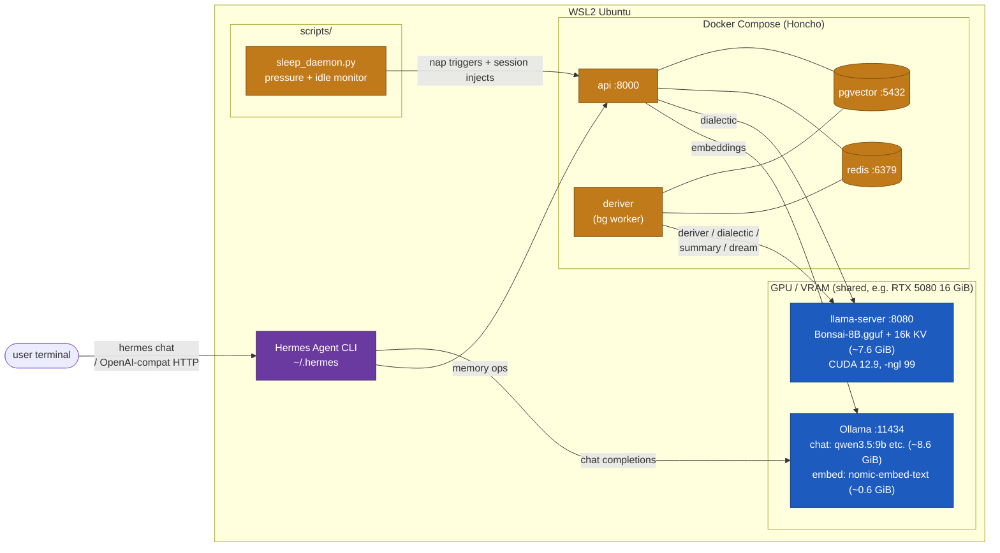

# Archived: the Bonsai-8B + Ollama two-endpoint recipe

This document preserves the **original** hermes-stack deployment recipe, before the architectural pivot documented in `bottleneck.md` and `bench-moe-offload/report.md`. It is no longer the recommended path — the current stack runs a single `llama-server` for chat + Honcho's memory loops (Qwen3.6-35B with MoE expert offload on `:8080`) plus a second `llama-server` for embeddings (nomic-embed-text on `:8081`), managed by `scripts/llama-services.sh`. See the main `README.md` for the active setup.

Kept here because:

- The design is defensible for a different shape of deployment (multi-user, ≥24 GiB VRAM, or cloud-hybrid where the two roles can live on separate hosts).
- The VRAM / parallelism / context / tool_choice discussion below still applies to any `llama.cpp` + Honcho combination, even without Bonsai.
- For historical understanding of what the "critical hyperparameters" in the gatekeeper-fork's config template were tuned against.

Why we stopped using it on this hardware:

- RTX 5080 16 GiB is too tight to keep Bonsai resident (7.6 GiB measured 6.3 GiB in follow-up) **and** run a heavy chat model with non-trivial context. `OLLAMA_GPU_OVERHEAD` reservation traded VRAM headroom for Bonsai-protection and there was no budget left for fitting qwen3.6:35b on GPU at ctx=64k.
- The MoE expert-tensor offload trick (`-ot "ffn_(up|down|gate)_exps=CPU"`) lets us run a single qwen3.6:35b instance at ~7.5 GiB VRAM with 36 tok/s decode — fast enough that the chat model can *also* serve Honcho's deriver/dialectic/summary/dream calls, making Bonsai's specialization moot on this hardware.
- Running two GPU-resident `llama-server` processes plus Ollama was operationally painful: three process managers, overlapping port usage, two places to patch tool_choice, and a persistent bring-up ordering dance.

See `bench-moe-offload/report.md` for the 8-cell placement benchmark (the L6 cell validated the single-endpoint config), `benchmark-honcho-hermes.md` for the Hermes-level wall-clock comparison across backends, and `bottleneck.md` §13 for the single-endpoint pivot writeup.

---

## Legacy architecture

- The **Honcho** memory backend's LLM calls (deriver / dialectic / summary / dream) are served by **Bonsai-8B** through `llama-server`.
- The main chat inference runs on **Ollama** with a heavier chat model.
- Embeddings also go through Ollama with a small embedding model (nomic-embed-text), so no cloud API key is required anywhere.

### Process layout (two-endpoint)



### Roles (two-endpoint)

| Component | Process | Resource | Responsibility |
|---|---|---|---|
| Ollama | `ollama serve` | GPU / VRAM (~9 GiB) | Hermes main inference + embeddings |
| Bonsai-8B | `llama-server` from PrismML's `llama.cpp` fork, built with CUDA 12.9 | GPU / VRAM (~7.6 GiB) | Honcho deriver / dialectic / summary / dream |
| Honcho | api + deriver + Postgres (pgvector) + Redis via Docker Compose | CPU / RAM | Conversation memory and user modelling |
| sleep_daemon | `python3 scripts/sleep_daemon.py` (systemd user service) | — | Detects idle or pending-queue pressure, fires dream + injects English system messages |
| Hermes Agent | `hermes` CLI | — | Orchestration |

Rationale for the split: Honcho's background agents (deriver / dialectic / summary / dream) all want tool-call reliability, which Bonsai was fine-tuned for. The chat-facing model is a separate concern and a larger general model served it through Ollama. Both processes shared the 16 GiB VRAM on the GPU as separate CUDA contexts.

---

## Critical hyperparameters (Bonsai-era)

These were the knobs that made the difference between "stack that remembers your conversations" and "stack that looks running but silently does nothing" in the two-endpoint design. Most of them map cleanly to the current single-endpoint stack (the main README covers those); the ones below are Bonsai / Ollama specific and do **not** apply once you collapse to a single `llama-server`.

### `llama-server --parallel` (scaffold 4 → **set to 1**) — Bonsai-specific

`llama-server`'s default allocated one KV cache per parallel slot (4 × `n_ctx`), then arbitrated among them. With `-c 16384 --parallel 4`, Bonsai would reserve 4 × ~6.5 GiB = 26 GiB of KV cache — impossible to fit on any 16/24 GiB consumer card. Honcho's deriver issued fairly long tool-call prompts that bounced between slots and tripped `failed to find free space in the KV cache`; deriver then hung silently (no log lines, no error) because its `httpx` call never returned.

- `--parallel 1` serialized requests so each one got the full context window and finished cleanly.
- Symptoms when wrong: `/slots` returned truncated/empty JSON, bonsai log showed `failed to find free space`, and `docker compose logs deriver` was silent for 10+ minutes.

Current stack: `scripts/llama-services.sh` leaves `--parallel` at llama.cpp's default because the single-endpoint config (`-c 65536`, KV q8_0) has enough VRAM headroom on a 16 GiB card for the smaller slot allocation, and Honcho's deriver is the only non-interactive client so contention is low.

### `llama-server -c` (scaffold 8192 → **16384** for Bonsai) — Bonsai-specific

Bonsai-8B was trained with a 65k context, so 16k was well within the model's native range. The chosen value had to give the deriver tool-call loop headroom: each round appended the model's previous output and the tool result, and a single representation task could accumulate 10–12k tokens before finishing; the scaffold's 8192 was not enough.

Current stack: `scripts/llama-services.sh` uses `-c 65536` against Qwen3.6-35B (which was trained with a 262k context) — larger because the chat model also needs the context for Hermes's multi-turn sessions.

### `BACKUP_PROVIDER` / `BACKUP_MODEL` (strip all lines) — applies to any deployment

The scaffold's backup provider pointed at Ollama for embeddings, which did not serve `bonsai-8b`. Leaving the lines in meant retry failures turned into `NotFoundError`s. **This guidance still applies to the current stack too**: in a local-only setup with one provider, there is no fallback chain — strip the flat `BACKUP_*` keys (legacy) or don't add the nested `fallback = { ... }` under any `[X.model_config]` block (new schema).

---

## Setup steps (Bonsai-era)

### Prerequisites addition

The two-endpoint design also required Ollama on the host:

| Requirement | Check |
|---|---|
| Ollama | `ollama --version` |

```bash
curl -fsSL https://ollama.com/install.sh | sh
```

### Step 1. Build Bonsai and start `llama-server`

The PrismML fork of `llama.cpp` is already checked out at `bonsai-llama.cpp/` by the recursive submodule clone. Build it **with CUDA on** and the `$ORIGIN` RPATH flags (see the main README — the RPATH fix is still load-bearing for any build, Bonsai or not).

```bash
cd "$HOME/nuncstans-hermes-stack/bonsai-llama.cpp"
export PATH=/usr/local/cuda/bin:$PATH
export LD_LIBRARY_PATH=/usr/local/cuda/lib64:$LD_LIBRARY_PATH
cmake -B build \
  -DGGML_CUDA=ON \
  -DCMAKE_BUILD_RPATH_USE_ORIGIN=ON \
  -DCMAKE_INSTALL_RPATH='$ORIGIN' \
  -DCMAKE_BUILD_WITH_INSTALL_RPATH=ON
cmake --build build -j --config Release --target llama-server
```

Download the Bonsai GGUF (~1.1 GiB):

```bash
cd "$HOME/nuncstans-hermes-stack"
mkdir -p models && cd models
curl -L -o Bonsai-8B.gguf \
  https://huggingface.co/prism-ml/Bonsai-8B-gguf/resolve/main/Bonsai-8B.gguf
```

Start `llama-server` in OpenAI-compatible mode with the Bonsai flags:

```bash
cd "$HOME/nuncstans-hermes-stack/bonsai-llama.cpp"
export LD_LIBRARY_PATH=/usr/local/cuda/lib64:$LD_LIBRARY_PATH
./build/bin/llama-server \
  -m "$HOME/nuncstans-hermes-stack/models/Bonsai-8B.gguf" \
  --host 0.0.0.0 --port 8080 \
  -ngl 99 \
  -c 16384 \
  --parallel 1 \
  --alias bonsai-8b \
  > "$HOME/nuncstans-hermes-stack/bonsai.log" 2>&1 &
```

`-ngl 99` puts the whole model + KV cache on the GPU. `--parallel 1` forces a single slot (see the Bonsai-specific hyperparameter note above).

Smoke test:

```bash
curl -s http://localhost:8080/v1/models | head
curl -s http://localhost:8080/v1/chat/completions \
  -H 'Content-Type: application/json' \
  -d '{"model":"bonsai-8b","messages":[{"role":"user","content":"ping"}],"max_tokens":8}'
```

### Step 2. Pull the chat and embedding models in Ollama

Ollama took the GPU. Hermes makes tool calls, so pick a function-calling-capable chat model that fits your VRAM.

```bash
# Main chat model (pick what fits your VRAM)
ollama pull glm-4.7-flash      # ~19GB, comfortable on a 24GB+ card
# ollama pull qwen3.5:9b         # ~6.6GB, for modest VRAM
# ollama pull llama3.1:70b       # ~42GB, needs 48GB+ VRAM

# Embedding model for Honcho (small, fast)
ollama pull nomic-embed-text   # 768 dims, ~274MB

# Honcho's embedding_client.py hardcodes the model name
# "openai/text-embedding-3-small", so alias nomic to that exact name.
ollama cp nomic-embed-text openai/text-embedding-3-small

ollama list
```

Configure the Ollama systemd service. Three environment variables matter:

```bash
sudo mkdir -p /etc/systemd/system/ollama.service.d
sudo tee /etc/systemd/system/ollama.service.d/override.conf > /dev/null <<'EOF'
[Service]
Environment="OLLAMA_HOST=0.0.0.0:11434"
Environment="OLLAMA_GPU_OVERHEAD=8589934592"
Environment="OLLAMA_CONTEXT_LENGTH=65536"
EOF
sudo systemctl daemon-reload
sudo systemctl restart ollama

curl -s http://localhost:11434/api/tags | head
```

**Why each variable was there:**

- `OLLAMA_HOST=0.0.0.0:11434` — Ollama defaults to `127.0.0.1`, which is unreachable from Docker containers. Honcho's embedding client (in the `honcho-api` / `honcho-deriver` containers) needs to hit Ollama through `host.docker.internal:11434`, and that only resolves when Ollama binds to all interfaces.

- `OLLAMA_GPU_OVERHEAD=8589934592` (8 GiB in bytes) — **reserves VRAM for the Bonsai `llama-server` process.** Bonsai (`-ngl 99 -c 16384`) took ~7.6 GiB of the RTX 5080's 16 GiB. Without this, Ollama's scheduler saw 16 GiB free on service start and happily loaded a model that filled the whole card — then Bonsai either failed to start or thrashed. 8 GiB here told Ollama "pretend 8 GiB is already in use", so it planned its own allocations against the remaining ~8 GiB. Required starting Bonsai **before** triggering any Ollama inference.

- `OLLAMA_CONTEXT_LENGTH=65536` — **prevents Ollama from silently truncating prompts at 4096 tokens.** Ollama's default `num_ctx` is 4096 regardless of what the GGUF declares. The OpenAI-compatible API has no `num_ctx` field, so Hermes (and any OpenAI-style client) can't pass it per-request — it has to be set as a service-wide default. When 4096 was used against a 13k-token prompt (realistic for Hermes once memory + dialectic context was folded in), Ollama truncated silently with only a log warning; the model then received a mid-sentence-cut prompt and emitted garbage (repeated paragraphs, `<|endoftext|>` token leakage, response times ballooning to 2+ minutes on `qwen3.6:35b`).

This env-var triple still applies to any remaining Ollama usage on this host, even though Ollama is no longer in hermes-stack's critical path.

### Step 3. Bring up Honcho and point it at Bonsai / Ollama

The honcho source is already populated — `honcho/` is a git submodule pinned to `baba-yu/nuncstans-honcho`. Upstream `.gitignore`s the live `config.toml`, so the submodule ships a committed `config.toml.bonsai-example` as the Bonsai-era template:

```bash
cd "$HOME/nuncstans-hermes-stack"
cp honcho/config.toml.bonsai-example honcho/config.toml
```

The Bonsai-era template pointed every Honcho LLM slot at the local llama-server via `[X.model_config.overrides] base_url = "http://host.docker.internal:8080/v1"` and embeddings at Ollama via `[embedding.model_config.overrides] base_url = "http://host.docker.internal:11434/v1"`. The live `config.toml` in the current stack has been re-pointed at the single-engine `:8080` (chat) / `:8081` (embed) URLs — see the main README for the current template values.

Populate `honcho/.env` with the one mandatory key:

```dotenv
# llama-server and Ollama both ignore the value but refuse empty strings.
LLM_OPENAI_API_KEY=not-needed
```

Start the stack:

```bash
cd "$HOME/nuncstans-hermes-stack/honcho"
docker compose up -d
docker compose ps
curl -s http://localhost:8000/health
```

The submodule ships its own `docker-compose.override.yml` that adds `host.docker.internal:host-gateway` (native Linux Docker Engine doesn't resolve that alias out of the box) and resets `ports: []` on `database` / `redis` to sidestep host 5432 / 6379 collisions.

---

## Fork-level patches (still applicable)

All three of these fork-level fixes are still baked into the gatekeeper submodule and still apply to the current single-endpoint stack — they are not Bonsai-specific:

1. **`host.docker.internal` resolution** on native Linux Docker Engine → handled by the submodule's `docker-compose.override.yml` (`extra_hosts: host.docker.internal:host-gateway`).
2. **Port collision guard** when the host already runs a Postgres or Redis on 5432 / 6379 → same override uses `ports: !reset []` to keep services internal to the compose network.
3. **pgvector column width 1536 → 768** for the nomic-embed-text output. Upstream honcho hardcodes `Vector(1536)` in `src/models.py` and in its initial migrations. The fork adds an `h8i9j0k1l2m3` migration that alters `documents.embedding` and `message_embeddings.embedding` to `Vector(768)` after upstream's schema lands; `[vector_store] MIGRATED = true` in `config.toml` tells the relaxed validator in `src/config.py` to accept non-1536 dims once the migration has run.

And one fork-level fix that is **Honcho-on-llama.cpp specific** (still applies to the current stack — the Qwen3.6 llama-server is an OpenAI-compatible llama.cpp endpoint, same as Bonsai was):

4. **`tool_choice = "any"` normalization.** Honcho's dialectic/deriver agents use `tool_choice = "any"` internally as an Anthropic-style synonym for `"required"`; the Anthropic and Gemini backends normalize it, but the upstream OpenAI backend forwards `"any"` unchanged. That works against vLLM (accepts `"any"` as a non-standard extension) and against legacy OpenAI endpoints, but **llama.cpp's OpenAI-compatible server rejects it** with `400 Invalid tool_choice: any`. Every Honcho call that touches tools (dialectic `/chat`, deriver observation extraction, dream consolidation) then dies after three tenacity retries, and from the Hermes side it looks identical to the 60-second stalls you'd see if `llama-server` weren't running at all. The fork (`nuncstans-honcho`, branch `dev`) normalizes `"any"` → `"required"` in `src/llm/backends/openai.py` so the same code path works against all three server families (OpenAI, vLLM, llama.cpp) without any config switch. If you ever replace the submodule with plain upstream Honcho, re-apply that one-liner or dialectic will stop working against the llama.cpp chat server without any obvious smoking gun in the logs.

---

## Archived sections pulled in from other experiments docs

Sections below were originally inside other `experiments/*.md` files but
assumed the Bonsai+Ollama two-endpoint topology. Moved here to keep
those parent docs focused on the single-endpoint reality. Source file
is noted at the top of each block so the provenance is obvious; text is
preserved verbatim except for the leading heading level.

### From `experiments/maintainer-notes.md` — "Bonsai + CPU is not a usable combination for this stack"

Original second-level header. Applies to the archived two-endpoint
design where Bonsai-8B was the memory LLM; doesn't apply to the
single-endpoint stack (which runs qwen3.6 on GPU for everything and
has no Bonsai process to speak of).

Bonsai-8B ships as a 1-bit quantised GGUF that *looks* like it should run fine on CPU — and it does, in the sense that `llama-cli` will produce text. But with Honcho's deriver and dream on top, CPU Bonsai is **too slow to keep up with real chat**:

- Per-call latency on CPU: 30–160 s for a deriver turn, 20–30 min for a single dream cycle (see `benchmark.md`).
- Honcho's dream agent tool-loops 20+ times; on CPU a dream blocks the single deriver worker (`WORKERS=1`) for the entire duration.
- Observations pile up as `pending` in `queue` while dream runs, and contradictory updates ("Alice died" ≠ "Alice lives in Kyoto") stay unresolved because dream never gets a chance to consolidate them before the next fire.
- On GPU (RTX 5080, CUDA 12.9, `-ngl 99`), the same workloads complete in 1–15 s. That is the only configuration this repo is tuned for.

**If you don't have an NVIDIA GPU**, do not try to make this recipe work by sitting through the CPU times. Instead, drop Bonsai entirely and point Honcho's `[deriver]` / `[dialectic]` / `[summary]` / `[dream]` at a different local memory-adjacent model you can run fast. Candidates:

- A cloud API via the `custom` / `openai` provider slots (OpenRouter, Venice, Together). Defeats the data-sovereignty goal but lets Honcho function.
- A smaller local model via Ollama — `qwen3.5:4b` or `gemma3:4b` via `PROVIDER = "custom"` and `MODEL = "qwen3.5:4b"`. Lower quality memory reasoning but acceptable for toy scale.
- vLLM or another GPU inference stack on a LAN machine, pointed to via `LLM_VLLM_BASE_URL`.

Whichever you pick, the hyperparameter section still applies — the scaffold defaults assume a fast backend and will look the same kind of broken if you pick a slow one.

### From `experiments/maintainer-notes.md` — "Why dream still lives on Bonsai, not the Ollama chat model"

Original second-level header. Made sense when dream ran on a separate
Bonsai-8B process and chat ran on Ollama. In the single-endpoint stack
dream runs on the same qwen3.6 `llama-server` as chat, so the whole
premise is gone.

We tried routing dream to Ollama (`qwen3.5:9b`) because Ollama already owns the GPU for chat. That produced hallucinated observations during the consolidation tool-loop (a fake employer, a made-up age field) because general chat models weren't trained to discipline themselves inside `search_memory` / `create_observations` / `delete_observations` loops. Bonsai was fine-tuned for exactly that. Keeping dream on Bonsai (separate `llama-server` process) means the two workloads coexist on VRAM via separate process address spaces, which both Ollama and `llama-server` handle without special coordination.

### From `experiments/memory-consolidation.md` — "Why dream runs on Bonsai (not the chat model)"

Original second-level header inside the sleep-daemon doc. Same premise
as the maintainer-notes section above but worded as a forward-looking
design justification. The single-endpoint config collapses the two
models into one and the "disciplined vs general chat" framing is
moot.

The scaffold wires dream to Bonsai and we keep it that way. Why not send dream to Ollama / the chat model to free Bonsai?

- **Bonsai-8B is trained for this task.** It's a Neuromancer-derivative fine-tune built specifically for observation-level memory reasoning; its tool-call discipline on `search_memory` / `create_observations` / `delete_observations` is how dream resolves contradictions cleanly.
- **General chat models hallucinate during consolidation.** We tried routing dream to `qwen3.5:9b` (the Ollama chat model) and dream started inventing facts during the tool loop — a fake employer, a made-up age field — rather than reconciling the observations actually in memory. Any general-purpose chat model does this to some degree; the consolidation task is too close to "fill in plausible details."
- **Separate process, shared VRAM.** Bonsai's `llama-server` and Ollama are independent processes. Both sit in the same 16 GiB VRAM on the RTX 5080 (Bonsai ~7.6 GiB + chat model ~8 GiB). No GPU-level coordination is needed — each process manages its own context and streams separately. If the user types while a dream is mid-flight, Ollama still answers promptly on its model and Bonsai continues on its own.
- **Idle-firing is still a nice-to-have.** Honcho cancels pending dreams whenever a user message arrives (`cancel_dreams_for_observed` in `src/deriver/enqueue.py`), so dreams naturally batch during quiet moments. On GPU this matters less (a dream ends in ~14 s so even an interruption is short), but the cancel behaviour is still useful to avoid redundant consolidation right before fresh observations land.

In short: dream runs on Bonsai because it's the right model for the task, and on GPU the cost is low enough that it can fire whenever Honcho's scheduler (or the sleep daemon) decides it's warranted.
